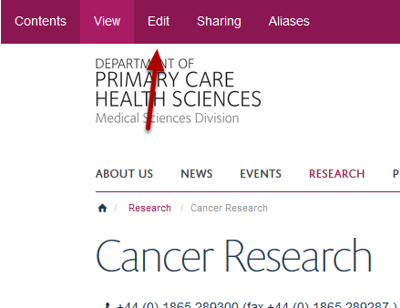
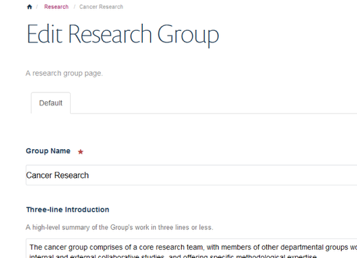
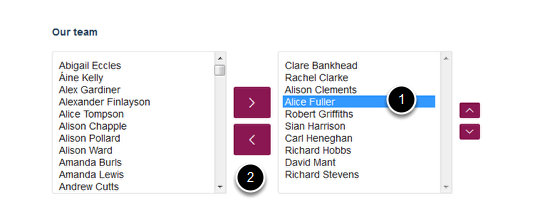
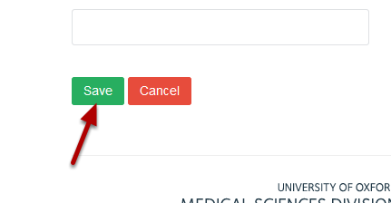

Remove a Research Group Member
======================================================================================================

.. note:: These user guides are being phased out and replaced with the guides on `Haiku Knowledge Base <https://fry-it.atlassian.net/wiki/display/HKB/Haiku+Knowledge+Base>`_

Shows you how to remove a group member from the team list on a research group page.	

Research Group page
-------------------------------------------------------------------------------------------

   

Go to the Research Group page you would like to edit and click on **Edit** on the left hand side of the toolbar at the top of the page to bring up the editing interface:

   

Remove group member
-------------------------------------------------------------------------------------------

   

Scroll down the page until you reach the **Our team** section. 
1. Select the group member you would like to remove from the right hand column (this is a list of staff in the research group).
2. Click on the bottom arrow to move the name to the left hand column (this is a list of staff with profiles in your department). 

Save your changes
-------------------------------------------------------------------------------------------

   

Scroll to the bottom of the page.
Click on **Save**.

