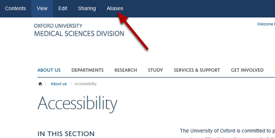
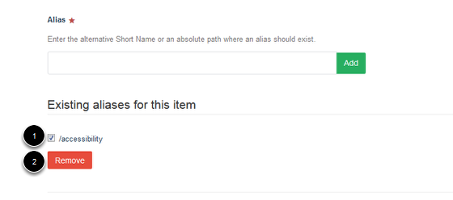

Remove an Alias
======================================================================================================

This show you how to delete an alias which has been set up as an additional web address for a page.	

Find your page
-------------------------------------------------------------------------------------------

   

Go to the page where you would like to remove the alias and click on Aliases on the top tool bar to take you to the Manage Aliases page. 

Manage Aliases page
-------------------------------------------------------------------------------------------

   

You will see a list of aliases which have been set up for the page. 
1. Select the check box next to the alias you would like to delete. 
2. Click on the **Remove** button. 

