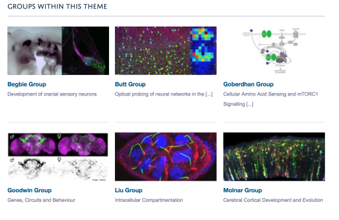

Research Group Descriptions on Research Theme Pages
======================================================================================================

On the list of Research Groups on a Research Theme page you can include a few descriptive words about the group as shown in the image below. This text is taken from the Three-line Introduction field on the Research Group (the text which displays above the Research Group image).  

If you would like this to display on your Research Theme pages please email haiku@medsci.ox.ac.uk	

   

