Research Group Overview
======================================================================================================

A research group page acts as a 'business card' for your research group, with links to the group members and publications. It's also possible to add up to three columns for additional information like specific projects. If you want, these columns can contain links to further pages belonging to your group.	

Finding your way around
-------------------------------------------------------------------------------------------

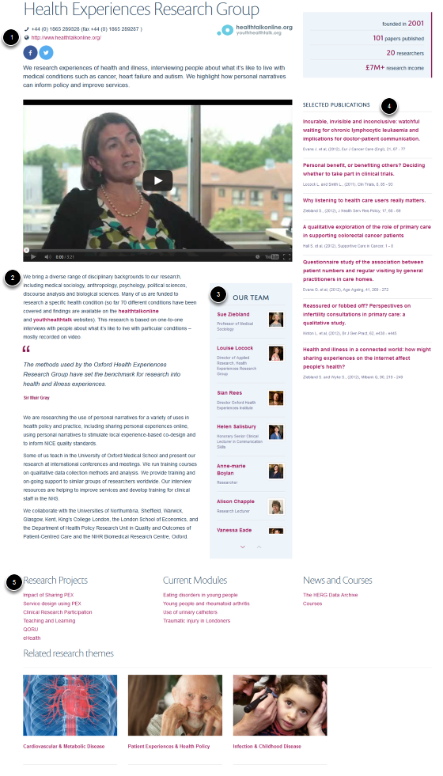
   

There's a substantial amount of information packed onto the one page, and it isn't always easy to find the relevant bit to edit behind the scenes. We've divided the page into 'areas':

# Header
# Main Text
# Team Members
# Publications
# Columns

The following screenshots aim to point you in the right direction, but there are also individual tutorial sections on most of the elements in these areas, if you need further guidance.

Editing the Header & Main Text
-------------------------------------------------------------------------------------------

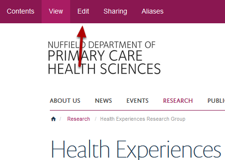
   

You can change or add elements in the Header and Main Text by filling in fields in the Edit Form. You reach this by clicking Edit in the Edit bar at the top of your screen. If you can't see the Edit bar then look for the little cog icon on the top right of your screen, click this and the bar will appear.

Locating the correct field to edit
-------------------------------------------------------------------------------------------

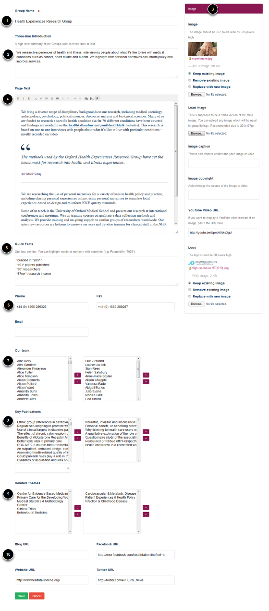
   

Scroll down the page to see the following sections:

1. Your Research Group name
2. Group summary - this displays under the group name
3. Images and other media
4. Main text content
5. Quick facts
6. Contact details
7. Research Group members
8. Publications
9. Research Themes your Research Group belongs to
10. Social media links

Editing the Team Members and Publications
-------------------------------------------------------------------------------------------

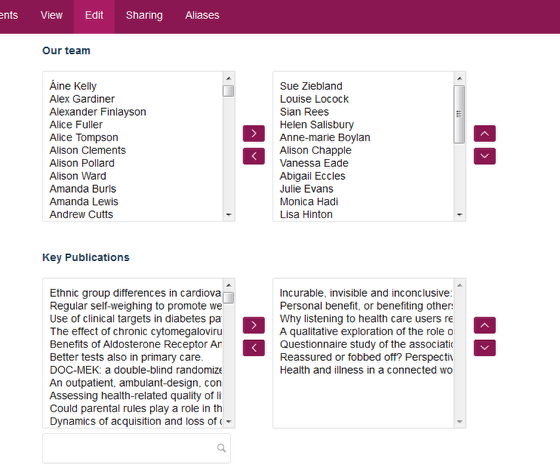
   

The lists of Team Members and Publications are compiled from items in the Our Team and Publications sections of the site. So no typing is required, you just need to select the relevant items from a list. Again, this is reached by clicking Edit in the Edit bar.

Columns
-------------------------------------------------------------------------------------------

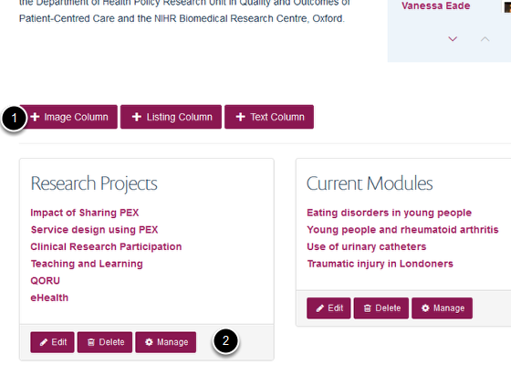
   

To Edit Columns, you need to go back to the View of the page. 

# The menu for adding columns is below the main text content area of the page. 
# The menu for editing an existing column is at the bottom of the column.

Text Column
-------------------------------------------------------------------------------------------

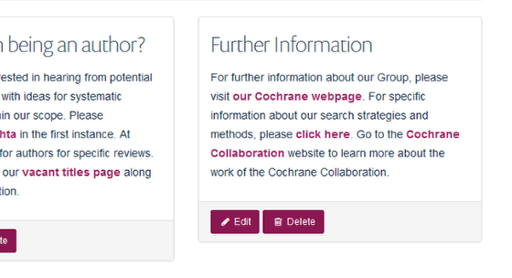
   

A Text Column is just a piece of static text. This can be useful if you want to make an announcement or draw attention to a specific aspect of your work. Here, the Cochrane Tobacco Group has used Text Columns to highlight specific aspects of their own external website. You can embed links in the text to pages on other people's websites or other sections of this website.

Listing Column
-------------------------------------------------------------------------------------------

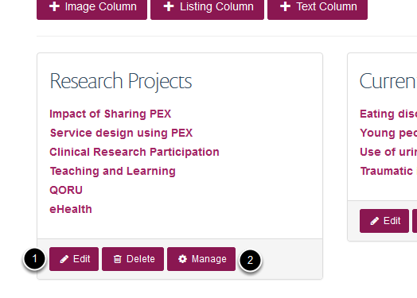
   

Listing Columns contain links to content that you create yourself. If the visitor clicks on one of the links, they will be taken to a page in a sub-section of your Group. This can be useful if you want to list your projects and also provide more information about them.

Click Edit (1) to change the title of the column and Manage (2) to add or order list items. Click the link title to edit the page being linked to.

A link to a page in a Listing Column
-------------------------------------------------------------------------------------------

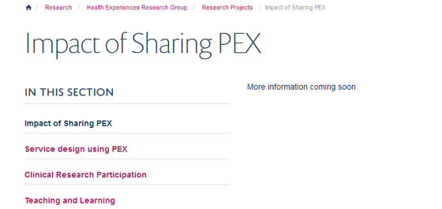
   

When a visitor clicks a link, it takes them to the relevant page in a section.

If you want to edit the content of the page, then use the Edit button in the Edit bar at the top of the page.

A link to another website in a Listing Column
-------------------------------------------------------------------------------------------

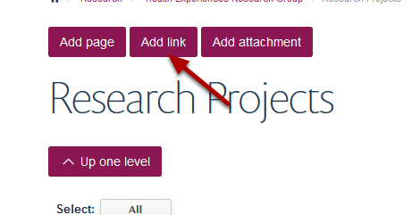
   

Sometimes you may want to provide a list of links to external websites or combine external links with your own pages in a list. For instance, you may have collaborators or partners with their own websites, or you may wish to include a joint project featured on another Group page. 

There's a button to add a link or a page in the manage view of the column.

Add a document for download to a Listing Column
-------------------------------------------------------------------------------------------

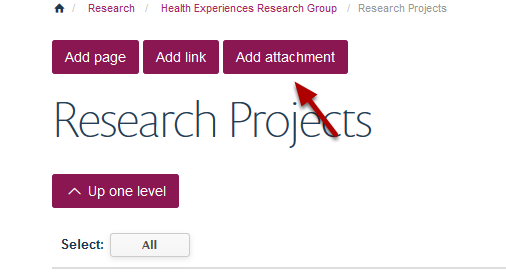
   

You can also add documents for download to your Listing Column. Click on Add attachment from the manage view of the column.

Site Tree
-------------------------------------------------------------------------------------------

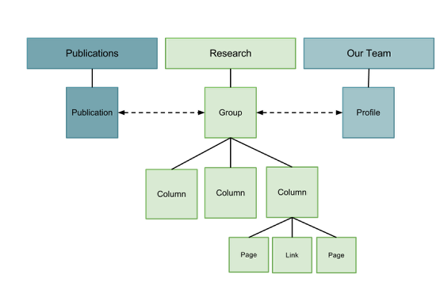
   

It sometimes helps to visualize the structure of a website as a tree diagram. 

