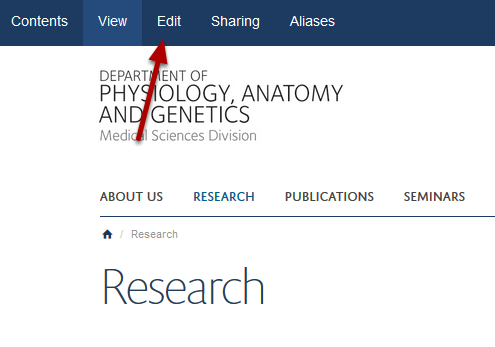
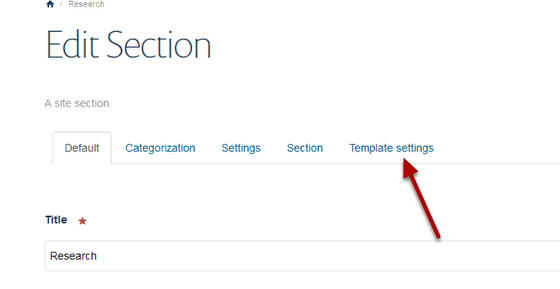
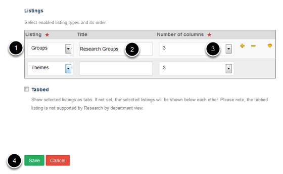
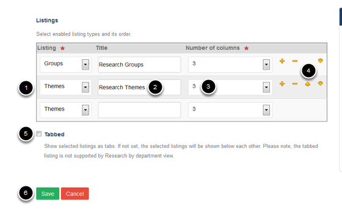

Research Section Display Options
======================================================================================================

.. note:: These user guides are being phased out and replaced with the guides on `Haiku Knowledge Base <https://fry-it.atlassian.net/wiki/display/HKB/Haiku+Knowledge+Base>`_

On the main page of the Research section you can choose whether you would like to display your Research Themes, Research Groups or Research Themes and Groups in the grid of images.  

If you choose to have both Research Themes and Groups on this page you can display the Themes and Group in tabs or on the same page. 	

Research section
-------------------------------------------------------------------------------------------

   

Go to the Research Section of your website. Click on **Edit** on the toolbar at the top of the page. 

Template settings
-------------------------------------------------------------------------------------------

   

Click on **Template settings**.

Select preferred display
-------------------------------------------------------------------------------------------

   

1. Select your preferred display option - either Groups or Themes - from the drop down list. 
2. Enter a title to appear above your grid of Research groups or themes if required. 
3. Select how many columns you would like in your grid of groups / themes.
4. Click on **Save**. 

Display both Research Groups and Research Themes
-------------------------------------------------------------------------------------------

   

1. If you would like Themes or Groups to display as a second set of images select this in the second row. 
2. Enter the title for this second set of images.
3. Select how many columns you would like in your grid of groups / themes.
4. You can change whether Groups or Themes display first by using the up and down arrows. Click on the minus sign to remove from the on screen display. 
5. Select **Tabbed** if you would like to display the Groups and Themes in tabs.  
6. Click on **Save**. 

