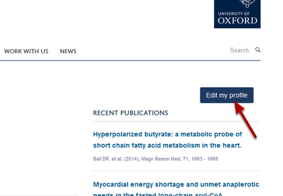
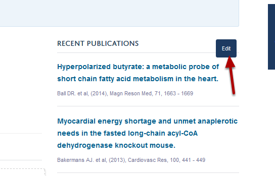
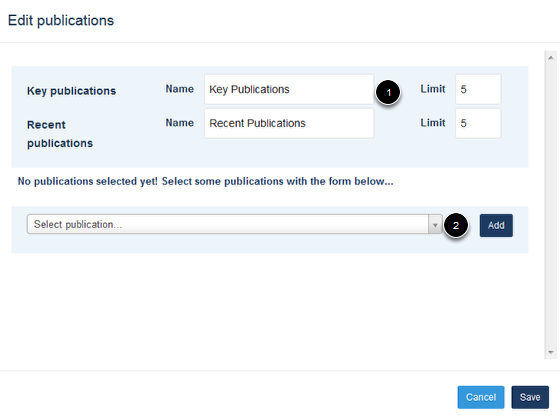
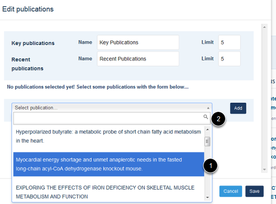
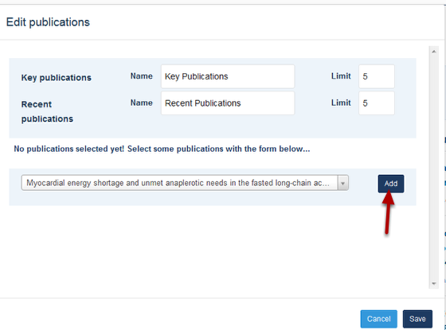
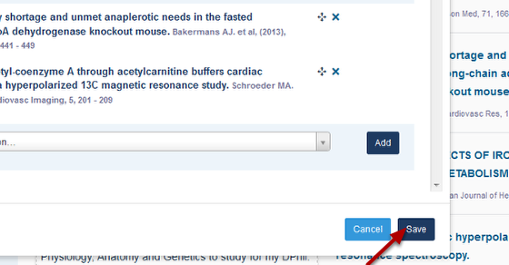
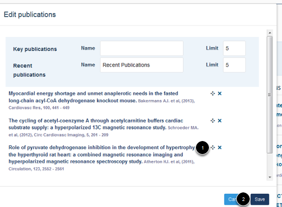
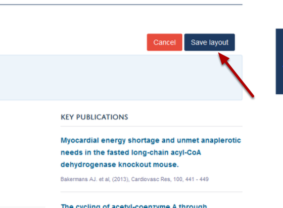

Select and Arrange your Key Publications
======================================================================================================

On your Profile page you will see that your five most recent publications are listed with a link to a page which lists all your publications. You can also choose to list up to five key publications. These will be listed above your list of recent publications.	

Edit your profile
-------------------------------------------------------------------------------------------

   

Go to your Profile page and click on the **Edit my profile** button just below the University logo. 

Edit your publications
-------------------------------------------------------------------------------------------

   

Click on the **Edit** button next to the Recent Publications heading. This button will appear when you place your cursor over the Publications tile. 
(If you have already selected some Key Publications this Edit button will be next to the Key Publications heading.)

Select publications
-------------------------------------------------------------------------------------------

   

1. Enter a heading for your selected publications
2. Click on the drop down menu to see a list of your publications:

   

There are two ways of selecting your publications: 
1. You can either scroll down and click on the title or
2. Search for the title in the search box

Add publication
-------------------------------------------------------------------------------------------

   

After selecting your publication click on the **Add** button.
Repeat the process for up to five publications.

Save your list
-------------------------------------------------------------------------------------------

   

When you have finished adding your publications click on the **Save** button.

Change the order of key publications
-------------------------------------------------------------------------------------------

   

You can change the display order of your key publications. To do this:
1. Click on the set of arrows next to the publication you would like to move and keeping your mouse button pressed down drag it up or down the list. 
2. Click on the **Save** button.

Save layout
-------------------------------------------------------------------------------------------

   

Click on the **Save layout** button just below the University logo. 

