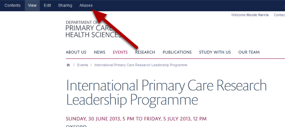
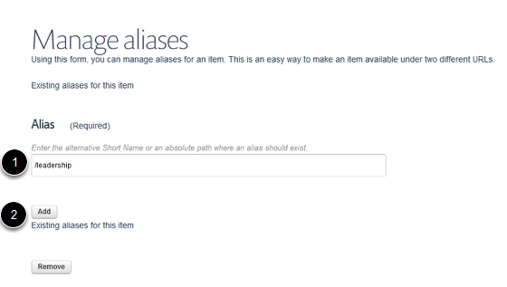
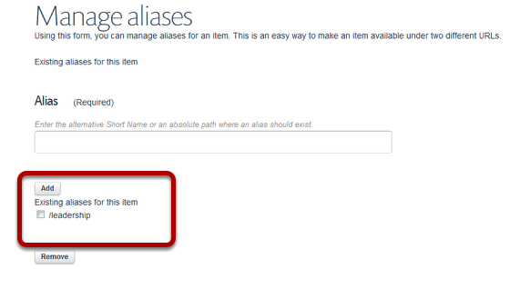
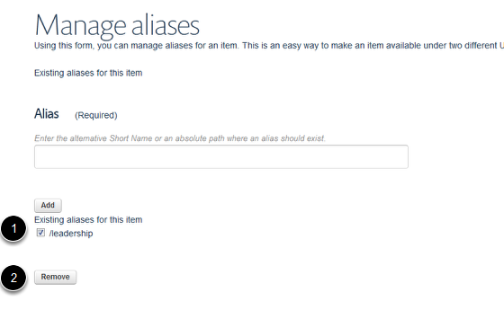

Set up an Alias / Give a Page an Alternate Web Address
======================================================================================================

Setting up an alias enables you to give a page an alternate web address. This can be used, for example, if you wish to have a simpler or shorter web address for publicity material or if you have moved the location of a page and would like set up the old web address as an additional address.

In this example we will give an Events page a shorter web address.	

Find your page and click on Aliases
-------------------------------------------------------------------------------------------

   

Go to the page you would like to give an additional web address to and click on Aliases. 

This page currently has a web address of: **www.phc.ox.ac.uk/events/international-primary-care-research-leadership-programme**
In the next step we will give this an alias of: **www.phc.ox.ac.uk/leadership**

Enter alternative web address
-------------------------------------------------------------------------------------------

   

1. Enter the alternative web address. Don't include the first part of the web address (e.g. www.phc.ox.ac.uk) - start with the first slash after ox.ac.uk . Don't have spaces in your web address - use hyphen instead.
2. Click on Add.

   

You will now see the alias listed under the Add button. 

Remove an alias
-------------------------------------------------------------------------------------------

   

To remove an alias:
1. Click in the check box next to alias you would like to delete.
2. Click on the Remove button. 

