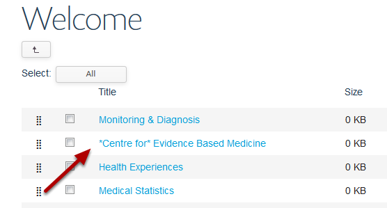
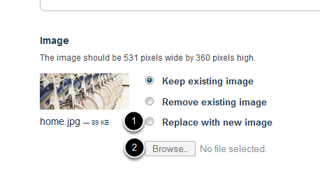
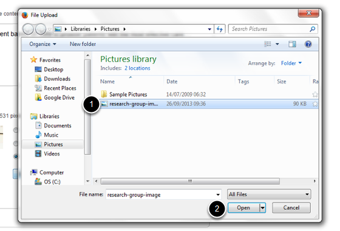
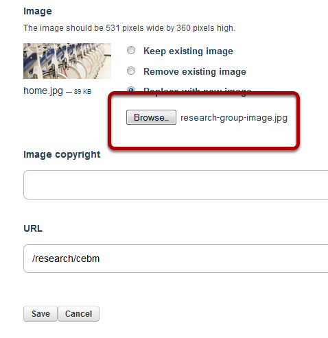

Slideshow - Change the Image on a Slide
======================================================================================================

This shows you how to change the image on an existing slide on your homepage.	

Select Slideshow
-------------------------------------------------------------------------------------------

   

From your homepage click on Slideshow on the top left hand side of the top toolbar. 

Select slide
-------------------------------------------------------------------------------------------

   

Select the slide where you would like to change the image. 

Edit slide
-------------------------------------------------------------------------------------------

   

Click on Edit on the top toolbar. 

Replace image
-------------------------------------------------------------------------------------------

   

1. Select Replace with new image.
2. Click on the Browse... button.

Find image
-------------------------------------------------------------------------------------------

   

1. Find the image you would like to use and highlight.
2. Click on Open.

   

You will see that the name of your new image appears next to the Browse... button. When you click on the Save button at the bottom of the page this image will replace the old image. 

