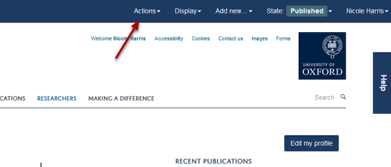
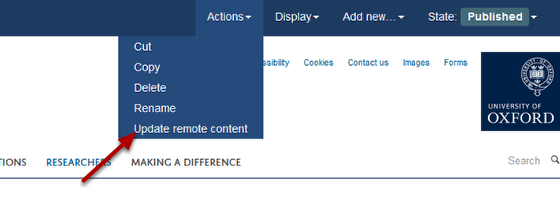

Sync a Remote Profile Manually
======================================================================================================

.. note:: These user guides are being phased out and replaced with the guides on `Haiku Knowledge Base <https://fry-it.atlassian.net/wiki/display/HKB/Haiku+Knowledge+Base>`_

Remote profiles sync automatically overnight. You can also sync a profile manually. This shows you how to do this.	

Go to the remote profile
-------------------------------------------------------------------------------------------

   

Go to the profile you would like to update and click on **Actions**.

Update profile
-------------------------------------------------------------------------------------------

   

Click on **Update remote content**.

