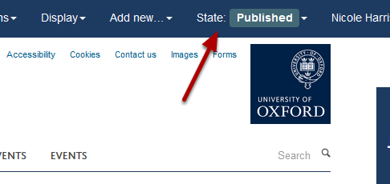
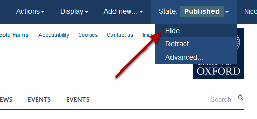
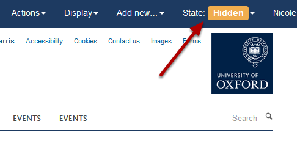

Unpublish your Webpage
======================================================================================================

You can unpublish your Webpage so that it isn't visible to the public. On the toolbar at the top of the screen you can see whether your page is Published. You need to change the State to **Hidden** to unpublish your page. 	

Page State
-------------------------------------------------------------------------------------------

   

Click on **State** on the right hand side of the top toolbar.

Unpublish the page
-------------------------------------------------------------------------------------------

   

From the dropdown menu select **Hide**. 

   

You will see that the State of the page has changed to **Hidden**. The page will only be visible to logged in users who have the necessary permissions to edit that page. 

