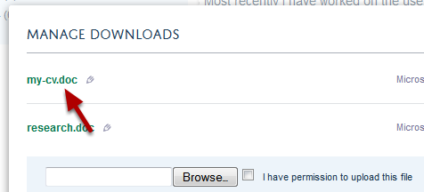
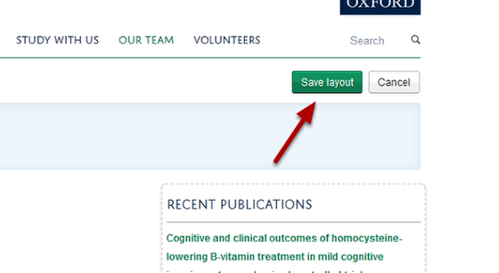

Upload, Rename and Arrange Documents on your Profile
======================================================================================================

You can upload documents to your profile for people to download. To do this you need to have added a Download tile. If you haven't already done this see the Add a Download Tile to your Profile tutorial. 
Documents must be smaller than 5MB. 	

Edit my profile
-------------------------------------------------------------------------------------------

   

Click on the Edit my profile button under the University logo. 

Edit Download Tile
-------------------------------------------------------------------------------------------

   

Click on the Edit button on your Download Tile. The button will appear when you move your cursor over the Downloads heading. Clicking the Edit button will bring up the following Upload box:

Locate your document
-------------------------------------------------------------------------------------------

   

Click on the Browse ... button and find the document on your computer that you would like to upload. If the document is larger then 5MB you will be unable to upload it. 

   

Once you have located your document:
1. Tick the check box confirming that you have persmission to upload the file.
2. Click on the Upload box.
3. Save you changes. 

Rename your document
-------------------------------------------------------------------------------------------

   

When you upload a document the link to the document will take the name of the file. You can change this. 
Find the document you would like to rename and click on the title.

   

The title will now be highlighted in yellow and you can edit the document name. 

   

Save your changes

Arrange your documents
-------------------------------------------------------------------------------------------

   

You can change the display order of your documents. To do this click on the set of grey arrows next to the document you would like to move and keeping your mouse button pressed down drag it up or down the list. 

Save your changes.

Save your page layout
-------------------------------------------------------------------------------------------

   

When you have finished editing the Download Tile click on the Save layout button located just under the University logo. 

