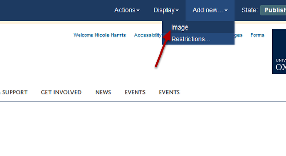
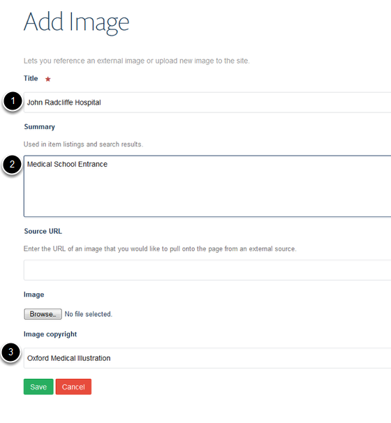
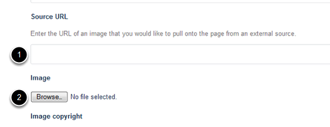
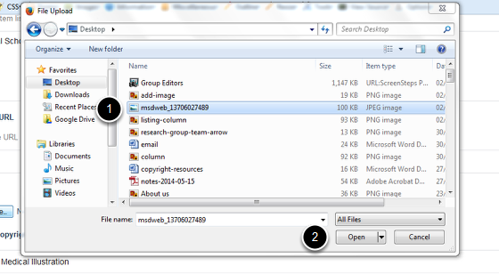
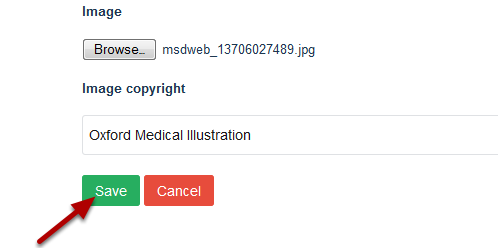

Upload an Image to the Image Library
======================================================================================================

.. note:: these user guides are being phased out and replaced with the guides on `Haiku Knowledge Base <https://fry-it.atlassian.net/wiki/display/HKB/Haiku+Knowledge+Base>`_

This show you how to add an image to the Image Library. 	

Images
-------------------------------------------------------------------------------------------

   

Click on **Images** on the top right of the page. 

Select folder
-------------------------------------------------------------------------------------------

   

Click on the folder you would like to add the image to.

If you want to set up a new folder see the **Add a Folder to the Image Library** guide.

Add image
-------------------------------------------------------------------------------------------

   

Click on the **Add new...** drop down menu from the toolbar at the top of the screen. 
Select Image.

Image details
-------------------------------------------------------------------------------------------

   

Enter information about your image:
1. Title
2. A description of the image (optional)
3. Copyright information.

Upload image
-------------------------------------------------------------------------------------------

   

To upload the image either:
1. Enter the web address of the image if the image has been published to the web 
Or
2. Click on **Browse ...** to upload the image from your computer.

Uploading image from your computer
-------------------------------------------------------------------------------------------

   

1. Select the image
2. Click on **Open**. 

Save the image
-------------------------------------------------------------------------------------------

   

Click on **Save**.

