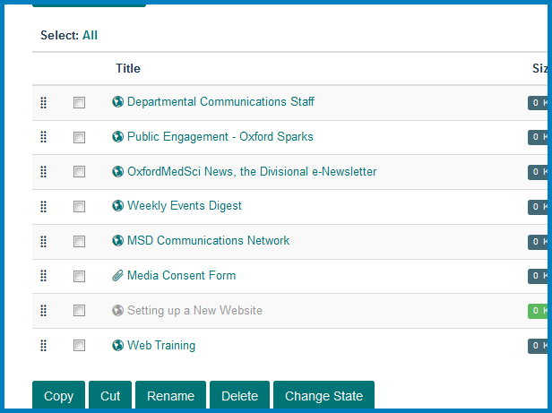
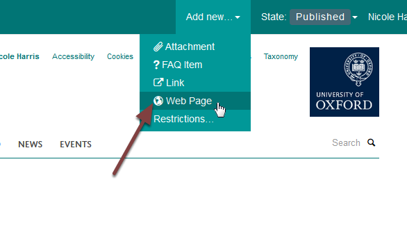
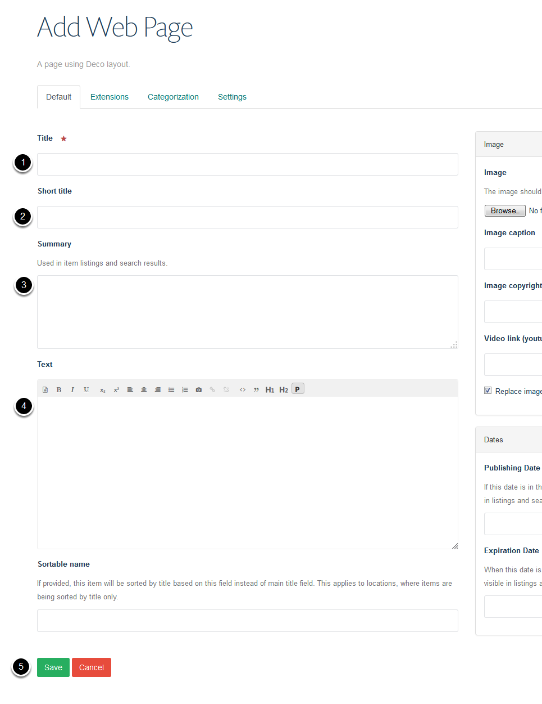

Add a Column Page
=================

This show you how to add an additional page to one of your columns of further information at the bottom of your team page.

Contents
--------

Click **Contents** on the toolbar at the top of the screen on your team page. 

.. image:: images/add-a-column-page/75d458da-9002-4b19-a945-57e6548c105b.png
   :alt: 
   :height: 433px
   :width: 710px
   :align: center

This lists the columns on your team page. 

Click the name of the column you would like to add a page to. 

Column contents
---------------

Add new web page
----------------

Click **Add new...** and select **Web Page**.

#. Enter the name of your page. It is best to keep page names short.
#. Short title. If you enter a short title this will form the last part of the web address
#. Page summary
#. Main content of the page
#. Click the **Save** button

Futher information
------------------