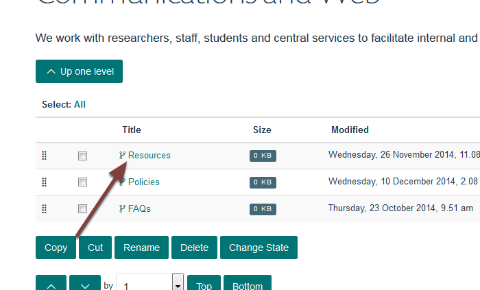

Add a Column Page
=================

This show you how to add an additional page to one of your columns of further information at the bottom of your team page.

Contents
--------

.. image:: images/add-a-column-page/contents.png
   :alt: 
   :height: 339px
   :width: 562px
   :align: center

Click **Contents** on the toolbar at the top of the screen on your team page. 

This lists the columns on your team page. 

Click the name of the column you would like to add a page to. 

Column contents
---------------

.. image:: images/add-a-column-page/column-contents.png
   :alt: 
   :height: 461px
   :width: 616px
   :align: center

Add new web page
----------------

.. image:: images/add-a-column-page/add-new-web-page.png
   :alt: 
   :height: 364px
   :width: 596px
   :align: center

Click **Add new...** and select **Web Page**.

.. image:: images/add-a-column-page/c8ff2a57-6683-4d39-a4ae-8d9a7e9d38f3.png
   :alt: 
   :height: 1261px
   :width: 975px
   :align: center

#. Enter the name of your page. It is best to keep page names short.
#. Short title. If you enter a short title this will form the last part of the web address
#. Page summary
#. Main content of the page
#. Click the **Save** button

Futher information
------------------