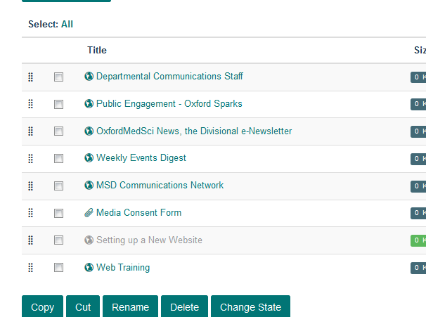

Add a Column Page
=================

This show you how to add an additional page to one of your columns of further information at the bottom of your team page.

Contents
--------

Click **Contents** on the toolbar at the top of the screen on your team page. 

This lists the columns on your team page. 

Click the name of the column you would like to add a page to. 

Column contents
---------------

This list all the pages, links and documents in the column. 

Add new web page
----------------

To add a new page click **Add new...** on the toolbar at the top of the page and select **Web Page**.

Add page details
----------------

#. Enter the name of your page. It is best to keep page names short.
#. Short title. If you enter a short title this will form the last part of the web address - the part after your team name. 
#. Page summary - this forms the first paragraph of your page and displays in a slightly larger font than the rest of the page. It will also display in the column under the page title and in search results. Adding a summary helps users assess whether this is the information they are looking for. 
#. Add the main content of the page. 
#. Click the **Save** button

Publish the page
----------------

You need to publish the page to make it visible to your website visitors. 

Click **State:** on the right of the toolbar at the top of the page and select **Publish**.

Published
---------

You will see that the state has now changed to **Published**.

New links are added to the bottom of the column. To change this see the guide below. 

Further information
-------------------

* :doc:`Create an Internal Link <Create_an_Internal_Link>`
* :doc:`Create a Link to an External Website <Create_a_Link_to_an_External_Website>`
* :doc:`Create an Email Link <create-an-email-link>`
* :doc:`Unpublish a Page <Unpublish_your_Webpage>` 
* :doc:`Add an Image to a Column Page <add-an-image-to-a-column-page>`