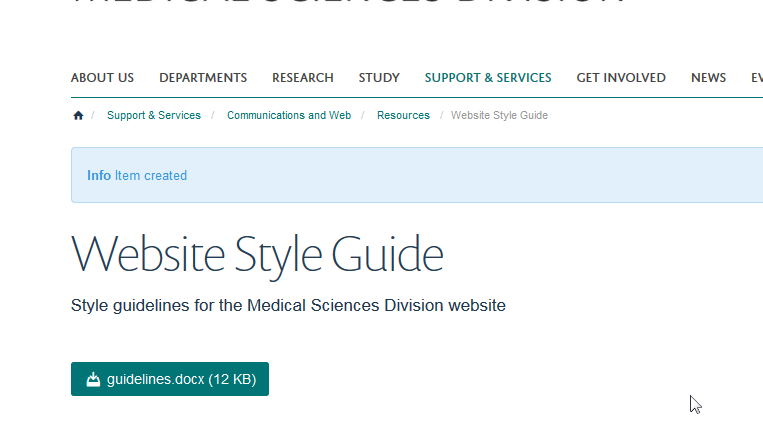

Add a Document to a Content Column
==================================

This shows you how to add a document to a Content Column. 

Contents
--------

Go to your team page and click the **Contents** link on the toolbar at the top of the screen. 

Column
------

Click the name of the column you would like to add a document to. 

Add Attachment
--------------

Click the **Add new...** link on the toolbar at the top of the page and select **Attachment**.

Document details
----------------

#. Enter a title for your document. This will form the link to your document on the column.
#. Enter a description for your document. This will display below the title of the document in your column and in search result, helping people to assess whether this is the information they are looking for.
#. Click the **Browse...** button and select the document you would like to upload.
#. Click **Save.**

Your document has been uploaded. Unlike webpages documents are automatically published so will be visible to visitors to the site as soon as you upload the document. 

Further information
-------------------

* Change the Display Order of Items in a Content Column