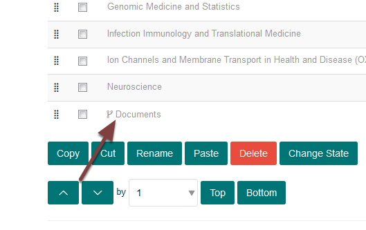
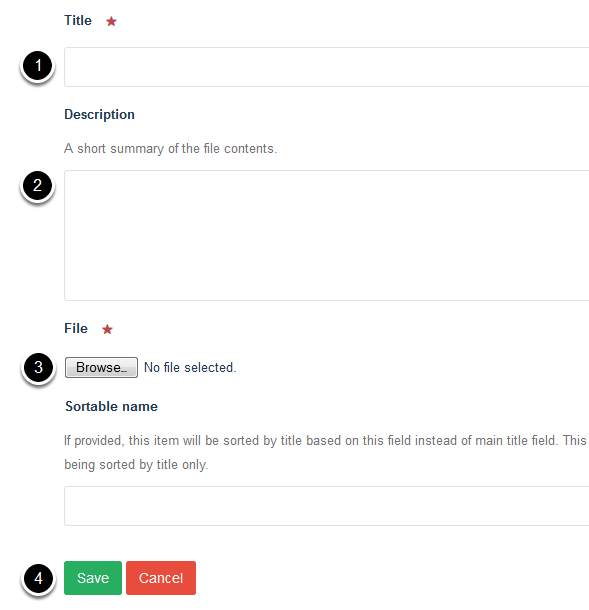

Add a Document to the Doctoral Training Centre (MSD Graduate School)
====================================================================

This shows you how to upload a document to the Doctoral Training Centre. 

Contents
--------

Go to the main page of the Doctoral Training Centre and click on **Contents**.

Documents
---------

Click the **Documents** link to go to the section where documents are uploaded.

Add Attachment
--------------

Click **Add new...** on the toolbar at the top of the page and select **Attachment**.

Upload document
---------------

#. Add a title for your document.
#. The description is displayed in search results making them more meaningful to users of the site.
#. Click **Browse ...** and upload your file.
#. Click **Save**. 

The document is now available to link to. For example, from a portlet on a course page. 

Further information
-------------------

:doc:`Edit a portlet on a course page (MSD Graduate School) <edit-a-portlet-on-a-course-page--msd-graduate-school->`