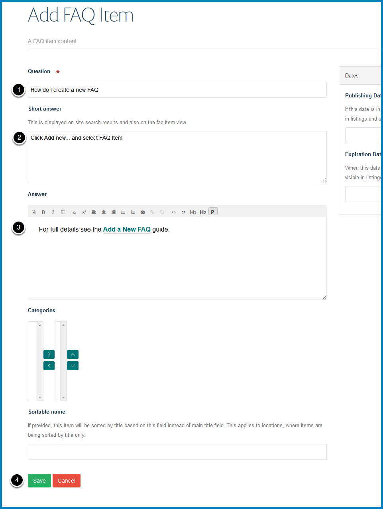

Add a FAQ
=========

You have the option to have a set of FAQs on your team page. This shows you how to add a FAQ to an existing FAQs list. 

If you would like to set up a FAQs section please email webmaster@medsci.ox.ac.uk

Contents
--------

Click **Contents** on the toolbar at the top of the page. 

Select your **FAQs** section which will show you a list of all your FAQs:

Add FAQ
-------

Click **Add new...** on the toolbar at the top of the page and select **FAQ Item**.

FAQ
---

#. Enter your question.
#. The short answer will display on the FAQ page, the :doc:`FAQ listing page <faqs-short-answer>` and on :doc:`search results <faqs-short-answer>`. Entering a short answer will help people know whether the FAQ is what they are looking for. 
#. Enter the FAQ answer. 
#. Click the **Save** button to create the FAQ:

Publish FAQ
-----------

You need to publish the FAQ so that visitors to the website can view the page. 

Click **State:** in the top right corner of the page and select **Publish**. The State will change to **Published**:

FAQ on Team page
----------------

Returning to your team page you will see the FAQ has been added to the bottom of your FAQs list. 

To change the display order of FAQs see the :doc:`Change the Display Order of FAQs <change-the-display-order-of-faqs>` guide. 

Further Information
-------------------

* :doc:`Create a FAQs section <create-a-faqs-section>`
* :doc:`Edit a FAQ <edit-a-faq>`
* :doc:`Change the Display Order of FAQs <change-the-display-order-of-faqs>`
* :doc:`Set the number of FAQs on display on your team page <set-the-number-of-faqs-on-display-on-your-team-page>`