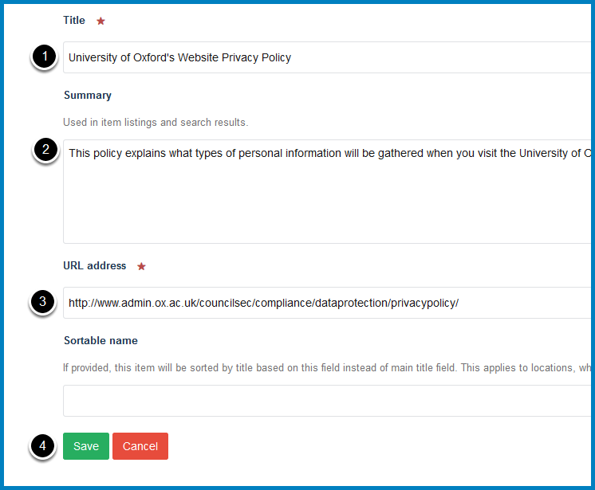

Add a Link to a Column
======================

You can add links to other websites to a content column on your team page. 

Go to your team page
--------------------

Click **Contents** on the toolbar at the top of your team page to see a list of your columns:

.. image:: images/add-a-link-to-a-column/3c2e05d8-b910-4012-bff9-44394e2e98c9.png
   :alt: 
   :height: 459px
   :width: 682px
   :align: center

Click the name of the column you would like to add the link to.

Column contents
---------------

.. image:: images/add-a-link-to-a-column/column-contents.png
   :alt: 
   :height: 514px
   :width: 691px
   :align: center

You will now see a list of the contents of the column.

Add Link
--------

.. image:: images/add-a-link-to-a-column/add-link.png
   :alt: 
   :height: 367px
   :width: 602px
   :align: center

Click **Add new...** and select **Link** on the toolbar at the top of the page. 

Link details
------------

#. Enter a title for the link
#. Enter a description of the link in the **Summary** field. This will display under the link title :doc:`in the column, on pages listing the link and in search result <link-summary-field>`. Entering a description will help people assess whether this is the information they are looking for. 
#. Enter the web address for your link in the **URL address** field. 
#. Click **Save** button

Publish link
------------

.. image:: images/add-a-link-to-a-column/publish-link.png
   :alt: 
   :height: 350px
   :width: 459px
   :align: center

You need to publish the link to make it visible to your website visitors. 

Click **State:** on the right of the toolbar at the top of the page and select **Publish**.

Published
---------

.. image:: images/add-a-link-to-a-column/published.png
   :alt: 
   :height: 319px
   :width: 403px
   :align: center

You will see that the state has now changed to **Published**.

New links are added to the bottom of the column. To change this see the guide below. 

Futher information
------------------

* :doc:`Change the order of webpages, links or documents in a column <change-the-display-order-of-webpages--links-or-documents-in-a-column>`