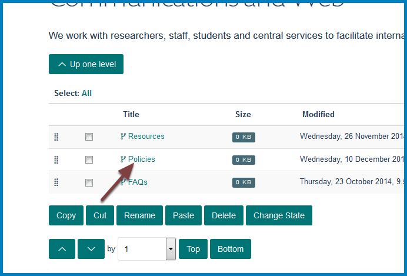
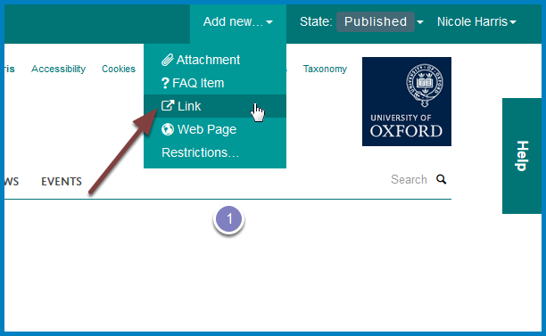
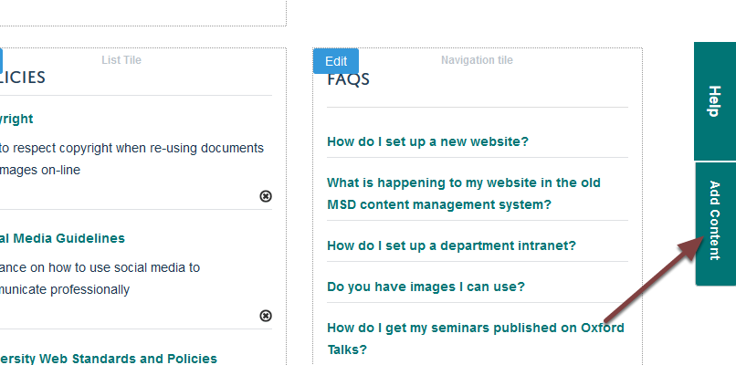
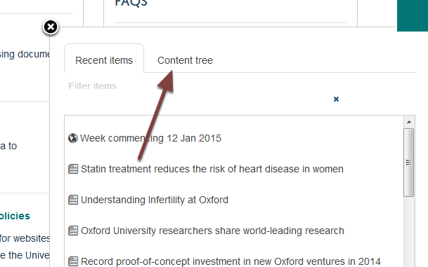
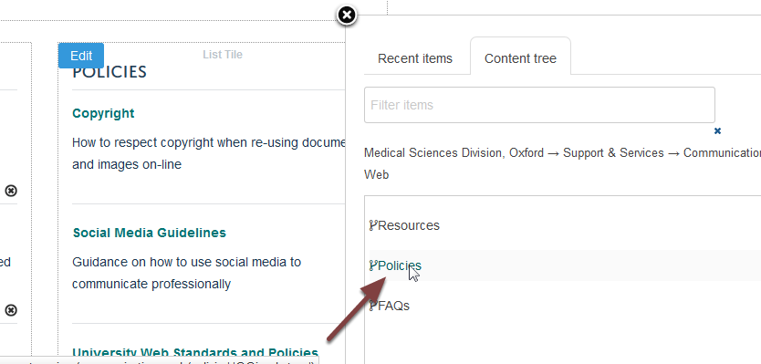
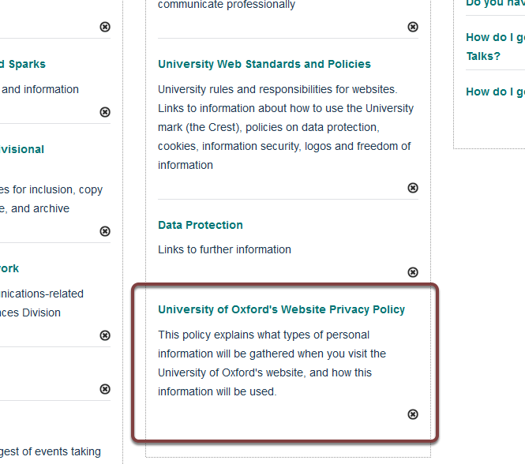

Add a Link to a Column
======================

You can add website links to the columns of further information on your team page. 

Go to your team page
--------------------

.. image:: images/add-a-link-to-a-column/go-to-your-team-page.png
   :alt: 
   :height: 414px
   :width: 554px
   :align: center

Click **Contents** on the toolbar at the top of your team page to see a list of your columns:

Click the name of the column you would like to add the link to.

Column contents
---------------

.. image:: images/add-a-link-to-a-column/column-contents.png
   :alt: 
   :height: 524px
   :width: 701px
   :align: center

You will now see a list of the contents of the column.

Add Link
--------

Click **Add new...** and select **Link** on the toolbar at the top of the page. 

Link details
------------

.. image:: images/add-a-link-to-a-column/link-details.png
   :alt: 
   :height: 615px
   :width: 746px
   :align: center

Enter details of the link:

#. Title for the link - this will form the link on the 
#. Summary
#. Web address
#. Click **Save** button

Publish link
------------

You need to publish the link to make it visible to your website visitors. 

Pull item onto your team page
-----------------------------

Click the **Edit** button on the top left corner of the column. 

