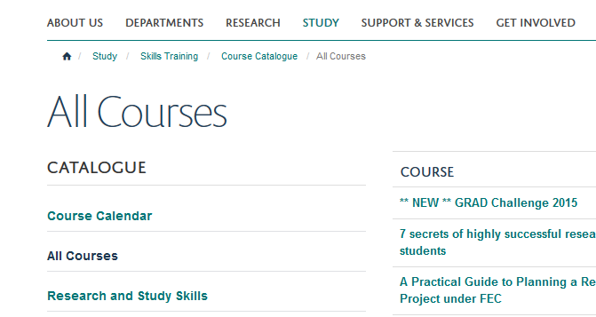
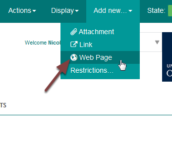
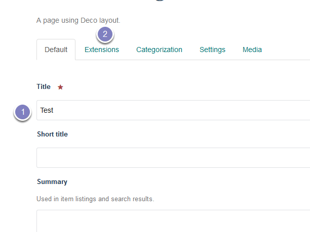
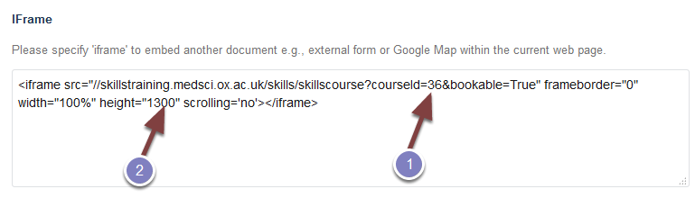
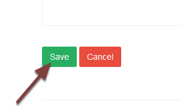
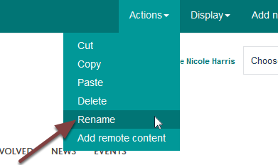
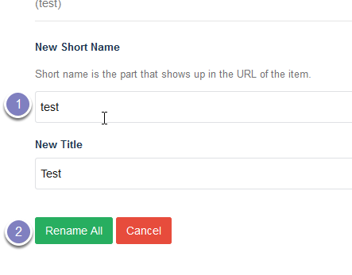
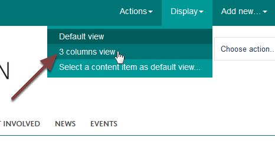
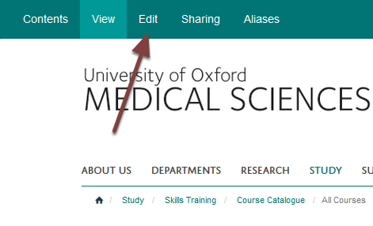
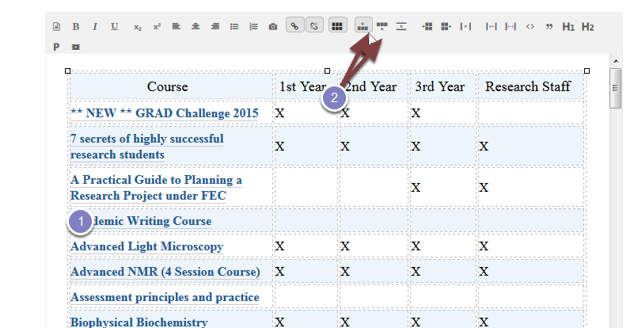

Add a New  Course (Skills Training)
===================================

This shows you how to add a new Skills Training course. 

All Courses
-----------

Go to the **All Courses** section of the website - `https://www.medsci.ox.ac.uk/study/skillstraining/coursecatalogue/allcourses <https://www.medsci.ox.ac.uk/study/skillstraining/coursecatalogue/allcourses>`_.

Add new page
------------

Click **Add new** from the toolbar at the top of the screen and select Web Page.

#. Enter the course title.
#. Click the Extension tab.

In the **IFrame** box paste: <iframe src="//skillstraining.medsci.ox.ac.uk/skills/skillscourse?courseId=36&bookable=True" frameborder="0" width="100%" height="1300" scrolling='no'></iframe>

#. Change the number (36 in this case) to the ID of your new course.
#. The height controls the space available for the iFrame on the course page. You might need to reduce or increase this. Start reducing or increasing by 100. 

Scroll to the bottom of the page and click Save.

Change web address of page
--------------------------

The last part of the web address is formed from the course title. To change this to the course ID click **Actions** from the toolbar at the top of the page and select **Rename**.

Change the text in the **New Short Name** box to the course ID and click the **Rename All** button. 

Change to 3 column view
-----------------------

Click **Display** at the top of the page and select **3 columns view**. 

The page needs to be changed to a 3 column view so that it is possible to have portlets on the right of the page to display further information or link to attachments. Changing the display to 3 column view makes the left hand navigation narrower so for consistency all course pages should be given a 3 column view.

Add page to the course listing
------------------------------

Go to the **All Courses** page and click **Edit**.

To add a new line to the table:

#. Click in the line before or after where you would like to add your course.
#. Click the add row before or after button to add an additional row.

Add you course details and link to the course. 

Scroll to the bottom of the page and click Save. 