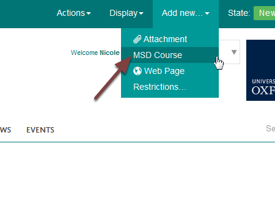
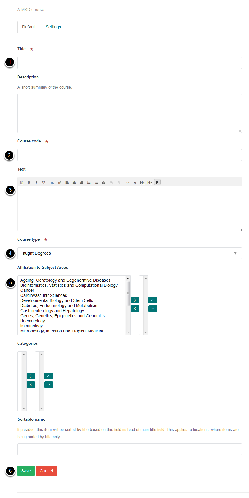
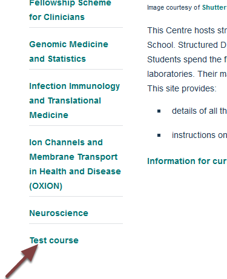
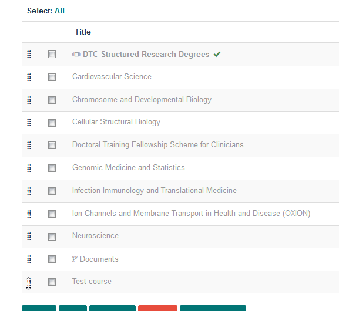
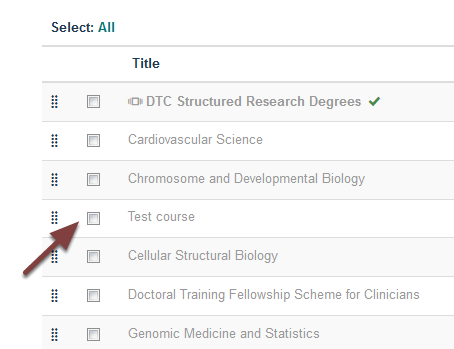
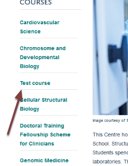

Add a New Doctoral Training Centre Course
=========================================

This shows you how to add a new Doctoral Training Centre Course. See the futher information section below for links to guides on how to add other types of courses to the MSD Graduate School. 

Add new
-------

Go to the main page of the Doctoral Training Centre.

Click the **Add new** link on the toolbar at the top of the page and select **MSD Course**. 

Course details
--------------

Enter the following details:

#. Course title
#. Course code
#. Course directors and link to course information on the University of Oxford admissions website
#. From the course drop down list select Doctoral Training Centre Degrees
#. Assign subject affiliations [See: :doc:`Assign a Subject Area to a Course <assign-subject-areas-to-courses>`]
#. And then click the Save button

New course added
----------------

Your new course will be added to the bottom of the list of courses. 

Change the order of courses
---------------------------

To change the order of the course click the Contents link on the toolbar at the top of the page. 

Move course
-----------

This shows you the pages and files in the Doctoral Training Centre section in the order that they are displayed. The DTC Structered Research Degrees page and the Documents folder are hidden from the navigation so that only the course pages display. 

To move the new course click on the set of dots next to the left of the course and drag the course to the correct position. For example:

View
----

.. image:: images/add-a-new-doctoral-training-centre-course/view.png
   :alt: 
   :height: 226px
   :width: 420px
   :align: center

Click View to return to the main Doctoral Training Centre page.

Course list
-----------

The course is now in the new position in the list of courses.

Further information
-------------------

* :doc:`Assign a Subject Area to a Course <assign-subject-areas-to-courses>` (MSD Graduate School)
* :doc:`Delete a Course <delete-a-course>` (MSD Graduate School)
* :doc:`Unpublish a Course <unpublish-a-course>` (MSD Graduate School)