Add a New Supervisor
====================

There are two types of supervisor profiles. 

#. Remote profiles - Supervisors who already have a profile on another Haiku website (see a list of :doc:`Departments using the Haiku CMS <msd-departments-using-haiku>`)
#. Local profiles - Supervisors who don't already have a Haiku profile. 

Go to the Supervisors section
-----------------------------

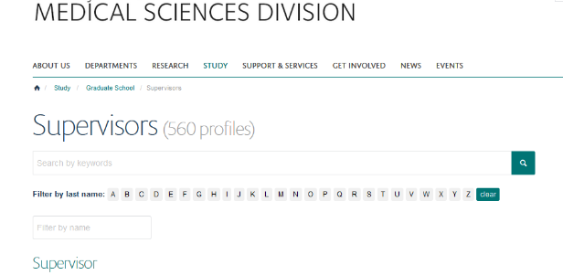

Both types of profiles are added from the main page of the supervisors section. 

1. Add a remote profile
-----------------------

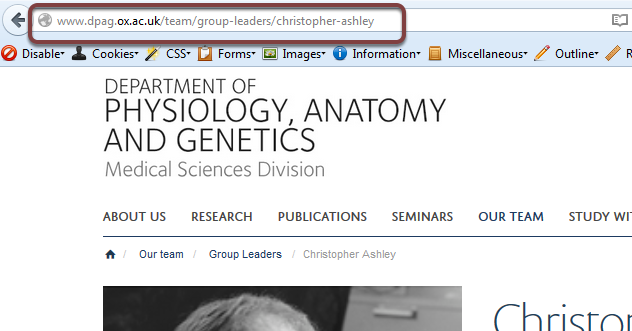

To add a remote profile find the person's profile on their department website and copy the web address. 

Add remote content
------------------

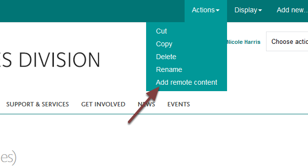

On the main supervisor's page on the MSD Graduate School site click **Actions** and select **Add remote content**.

Remote publisher
----------------

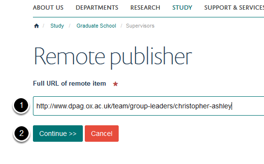

#. Paste the web address of the profile into the **Full URL of remote item** box.
#. Click the **Continue >>** button.

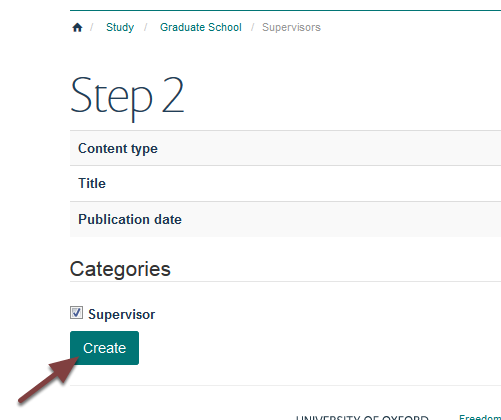

Click the **Create** button.

Edit profile
------------

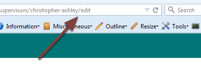

Type **/edit** on the end of the web address and press your Enter key. 

Supervisor category
-------------------

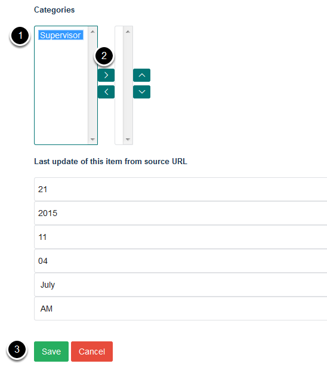

Scroll down the page to the **Categories** section. Items in the left column are available profile category types. Items in the right column are categories applied to the profile.

#. Higlight **Supervisor.**
#. Click on the top arrow to move the Supervisor into the right hand column.
#. Click **Save**. 

Publish profile
---------------

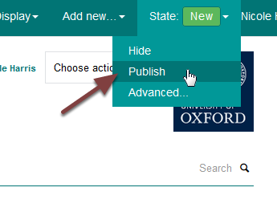

When you create a new profile it is unpublished and not visible to visitors to the website. 

To publish the profile click the **New** button and select **Publish** from the drop down menu. 

2. Add a local profile
----------------------

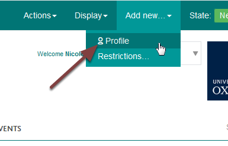

To add a local profile go to the main supervisor page and click **Add new** and select **Profile**.

Profile details
---------------

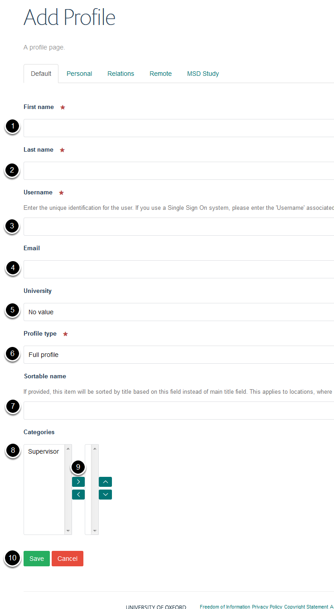

To create a new local supervisor:

#. Supervisor's first name
#. Supervisor's surname
#. Single sign on username 
#. Email address
#. Make sure **No value** is selected
#. Check **Full profile** is selected
#. Leave the **Sortable name** field blank
#. Click on Supervisor
#. Click on the top arrow
#. Click Save

Edit my profile
---------------

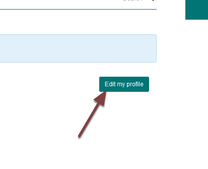

A basic profile has now been created. To change contact details and add research interests and any further information click **Edit my profile**.

See the following guides on how to:

#. :doc:`Change / Add Contact Details on your Profile <Change__Add_Contact_Details_on_your_Profile>`
#. :doc:`Add Research Interests to a Profile (MSD Graduate School) <add-a-supervisor-s-research-interests-to-their-profile>`
#. Add further research information to a supervisor (available soon)
#. Add a link to a supervisor's department or personal website (available soon)

Save layout
-----------

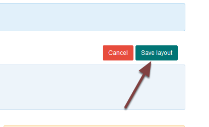

After you have made your changes click **Save layout**. 

Publish profile
---------------

When you create a new profile it is unpublished and not visible to visitors to the website. 

To publish the profile click the **New** button and select **Publish** from the drop down menu. 

Further Information
-------------------

#. :doc:`Add a Course and/or Subject Area to a Supervisor <add-a-course---subject-area-to-a-supervisor>`
#. :doc:`Remove a Course and/or Subject Area from a Supervisor <remove-a-course-and-or-subject-area-from-a-supervisor>`
#. :doc:`Add a Supervisor to a Doctoral Training Centre Course <add-a-supervisor-to-a-doctoral-training-centre-course>`