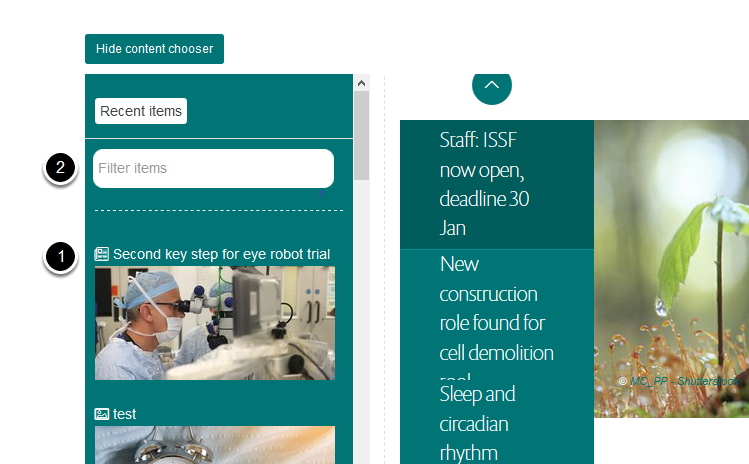
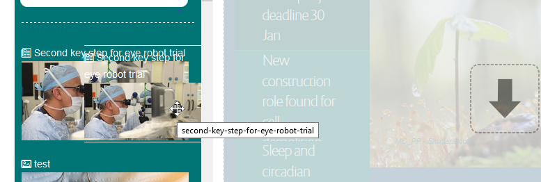
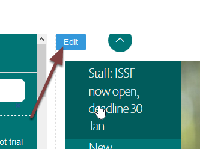

Add a News Item to the Homepage Slideshow
=========================================

This shows you how to add a news item to the slideshow. You can also add an image and link that directly to another webpage - see  `Add a Slide to the Homepage Slideshow <http://haiku-user-guide.readthedocs.io/en/latest/content/add-a-slide-on-the-homepage.html>`_ guide on the for details.

Compose
-------

.. image:: images/add-a-news-item-to-the-homepage-slideshow/compose.png
   :alt: 
   :height: 286px
   :width: 563px
   :align: center

Go to the homepage. Click **Compose** on the toolbar at the top of the page. 

Add news item
-------------

You will find the news item either:

#. In the list of recent items if it was added recently, or
#. By searching for the item by title. 

Drag the news item onto the slideshow.

Remove a slide from the slideshow
---------------------------------

You can only have three items on the slideshow. To remove an item hold your cursor over the slideshow to reveal an **Edit** button in the top left corner. Click the **Edit** button. 

#. Click the cross next to the item you would like to remove.
#. Click **Save**.