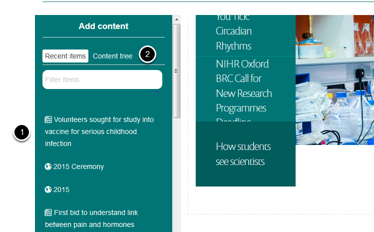
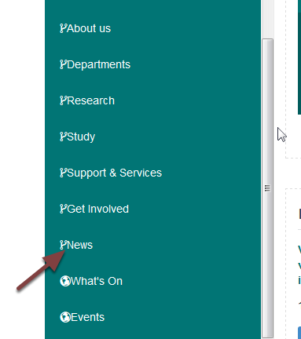
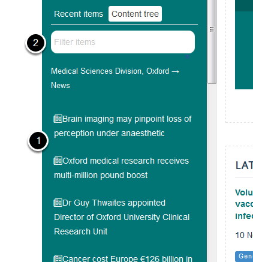
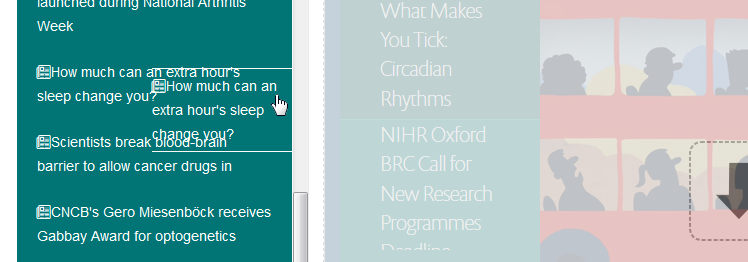

Add a News Item to the Homepage Slideshow
=========================================

This shows you how to add a news item to the slideshow. You can also add an image and link that directly to another webpage - see  Change the Slide on the for details.

Compose
-------

On the homepage click **Compose** on the toolbar at the top of the page. 

Add content
-----------

You will find the news item in either:

#. The list of recent items if it was added recently, or
#. Click **Content tree **to find older items and follow the step below:

Click **News**

