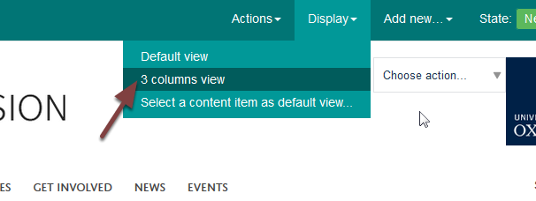

Add a Portlet to the Right Side of a Course Page
================================================

You can have a portlet on the right side of course page for additional information or linking to attachments.

Display
-------

The display on a page needs to be a **3 column view** for the portlet to show. 

To check that the page has a 3 column view click **Display** and select **3 column view** if this isn't already shaded a darker green.

Manage portlets
---------------

Click your name on the right side of the page and select **Manage portlets**. 

Add portlet
-----------

Select **Static text** from the drop down list on the **Secondary Portlets** option on the right of the page. 

Enter content
-------------

Enter your content. 

#. The heading box is optional - you can create headings in the text editor instead. 
#. Enter your main content in the text editing box.  

Save
----

Scroll to the bottom of the page and click **Save**. 

Click **Return** to go back to your page.

Your portlet
------------

You will now see your portlet on the right of the page. 