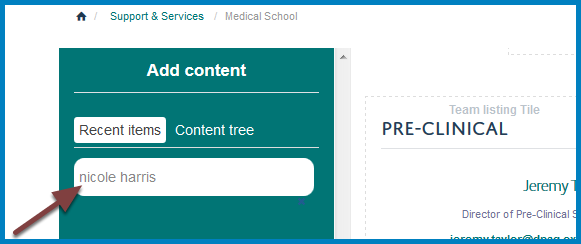
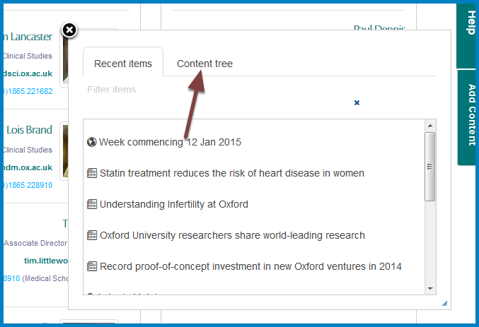
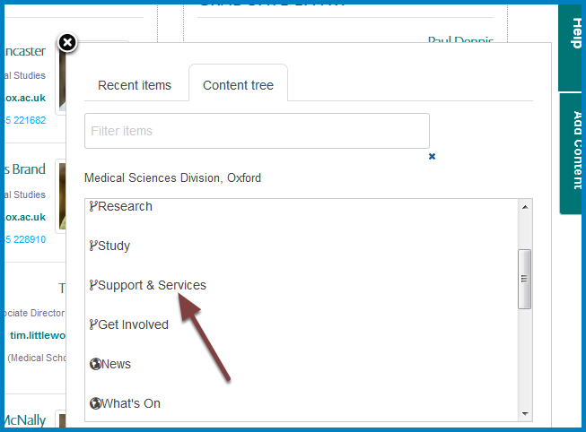
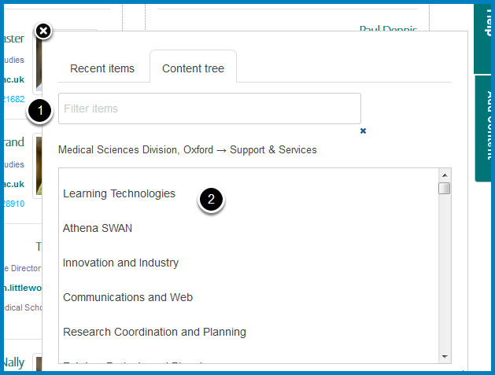
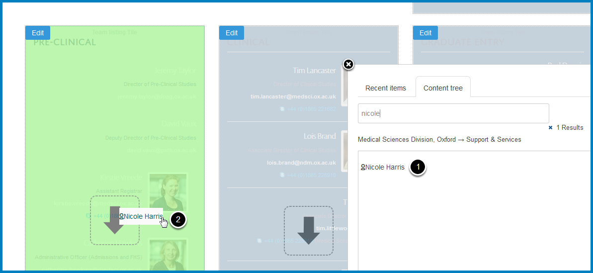
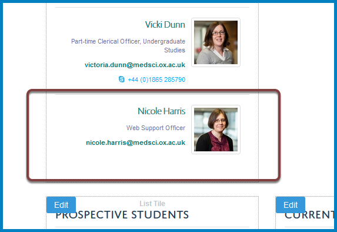

Add a Profile to a Column Listing Profiles
==========================================

You can have a column listing profiles. This shows you how to add profiles.

If you would like to create a new column listing profiles please email webmaster@medsci.ox.ac.uk

Compose
-------

.. image:: images/add-a-profile-to-a-column-listing-profiles/compose.png
   :alt: 
   :height: 326px
   :width: 611px
   :align: center

To make any change to your column click on **Compose** on the toolbar at the top of the page. 

Add Content
-----------

Scroll down to your column and click the **Add Content** button on the right of the screen. 

Content tree
------------

Click **Content tree**.

Support & Services
------------------

Click **Support & Services**.

Find profile
------------

Find the person you would like to add to your column by either:

#. Searching for their name
#. Scrolling down the list until you see their name

Add profile
-----------

#. Hold the mouse down on the person's name and drag across to the required column
#. Release your mouse button when you have 

This has added the profile to the bottom of the column. 

Further information
-------------------

* :doc:`Remove Profiles from a Column Listing Profiles <remove-profiles-from-a-column-listing-profiles>`
* :doc:`Change the Order of Profiles in a Column Listing Profiles <change-the-order-of-profiles-in-a-profiles-listing-column>` 
* :doc:`Change the Title of a Column <change-a-column-title>`