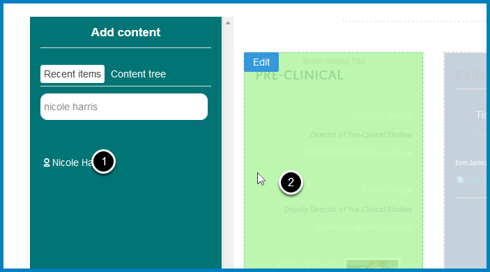

Add a Profile to a Column Listing Profiles
==========================================

.. note:: these user guides are being phased out and replaced with the guides on `Haiku Knowledge Base <https://fry-it.atlassian.net/wiki/display/HKB/Haiku+Knowledge+Base>`_

You can have a column listing profiles. This shows you how to add profiles.

If you would like to create a new column listing profiles please email webmaster@medsci.ox.ac.uk

Compose
-------

.. image:: images/add-a-profile-to-a-column-listing-profiles/compose.png
   :alt: 
   :height: 326px
   :width: 611px
   :align: center

To make any change to your column click on **Compose** on the toolbar at the top of the page. 

Add Content
-----------

.. image:: images/add-a-profile-to-a-column-listing-profiles/add-content.png
   :alt: 
   :height: 244px
   :width: 581px
   :align: center

Search for the person you would like to add in the search box in the **Add content** section. 

Add profile
-----------

#. Hold the mouse down on the person's name
#. Drag to the column. This will change colour as you move over it. 

If you need to change the order of the profile in the column see: :doc:`Change the Order of Profiles in a Column Listing Profiles <change-the-order-of-profiles-in-a-column-listing-profiles>`

Further information
-------------------

* :doc:`Remove Profiles from a Column Listing Profiles <remove-profiles-from-a-column-listing-profiles>`
* :doc:`Change the Order of Profiles in a Column Listing Profiles <change-the-order-of-profiles-in-a-column-listing-profiles>`