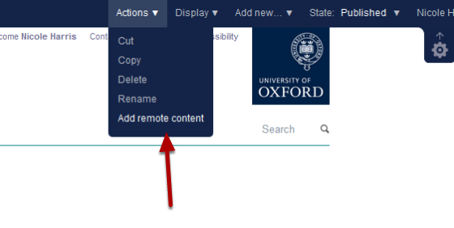
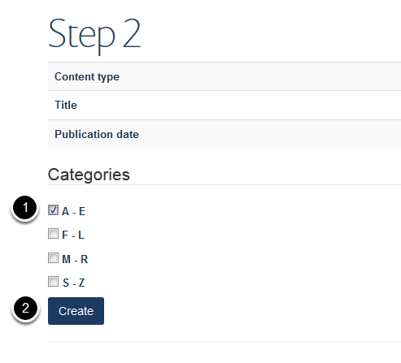

Add a Remote Profile
====================

.. note:: these user guides are being phased out and replaced with the guides on `Haiku Knowledge Base <https://fry-it.atlassian.net/wiki/display/HKB/Haiku+Knowledge+Base>`_

A remote profile enables you to add a profile from another Haiku website in your team listing. Changes made to the original profile are updated overnight on the remote profile. 

Find profile
------------

.. image:: images/add-a-remote-profile/find-profile.png
   :alt: 
   :height: 307px
   :width: 547px
   :align: center

Find the profile of the person you would like to include on your Team page.

Copy the web address - if you are logged into the site don't include the https 

Team section
------------

Go to your team section and click **Actions** on the right hand side of the top tool bar and select **Add remote content**.

Paste web address 
------------------

.. image:: images/add-a-remote-profile/paste-web-address-.png
   :alt: 
   :height: 228px
   :width: 560px
   :align: center

#. Paste the web address of the profile that you copied in the first stage into the **Full URL of remote item** box.
#. Click **Continue >>**

Profile category
----------------

#. Select the profile category - you can select more than one. 
#. Click **Create**.

Publish profile
---------------

.. image:: images/add-a-remote-profile/publish-profile.png
   :alt: 
   :height: 212px
   :width: 417px
   :align: center

The remote profile is now available on your site as an unpublished profile. To publish the profile click **State** on the right hand side of the tool bar and select **Publish**. 