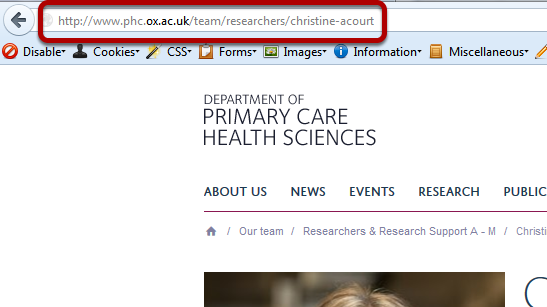
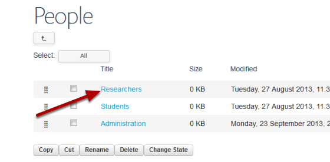
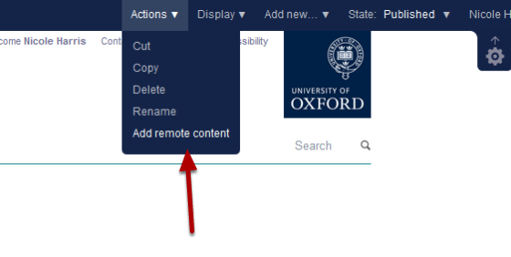
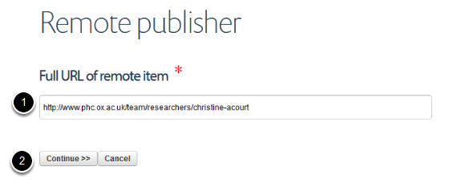
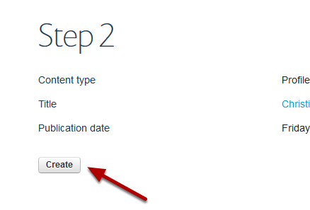
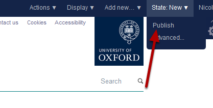

Add a Remote Profile
====================

A remote profile enables you to add a profile from another Haiku website in your team listing. Changes made to the original profile are updated overnight on the remote profile. 

Find profile
------------

Find the profile of the person you would like to include on your Team page.

Copy the web address - if you are logged into the site don't include the https 

Select column
-------------

Go to your Our Team / People page and click **Contents** on the top left hand side of the toolbar. 

Select column
-------------

Select the column you would like to add the remote profile to.

Select view
-----------

Click **View** on the top tool bar. 

Add remote content
------------------

Click **Actions** on the right hand side of the top tool bar and select **Add remote content**.

Paste web address 
------------------

#. Paste the web address of the profile that you copied in the first stage into the **Full URL of remote item** box.
#. Click **Continue >>**

Click **Create**.

Publish profile
---------------

The remote profile is now available on your site as an unpublished profile. To publish the profile click **State** on the right hand side of the tool bar and select **Publish**. 