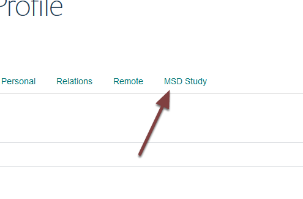
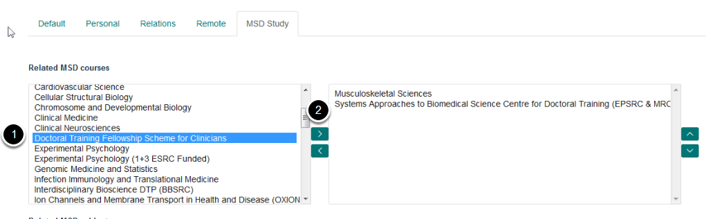
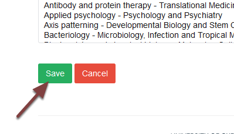

Add a Supervisor to a Doctoral Training Centre Course
=====================================================

Doctoral Training Centre Structured Degree course pages include a list of supervisors. To add a supervisor to a course you need to add the course name to the supervisor's profile. The supervisor will then be listed on the course page. 

Edit the supervisor's profile
-----------------------------

Go the supervisor's profile. To edit:

#. Local profiles (profiles set up on the MSD website) click on **Edit** on the toolbar at the top of the page.
#. Remote profiles (which have been pulled in from another Haiku website) type /edit at the end of the web address: eg `https://www.medsci.ox.ac.uk/study/graduateschool/supervisors/supervisors-folder/ivan-ahel <https://www.medsci.ox.ac.uk/study/graduateschool/supervisors/supervisors-folder/ivan-ahel>`_ becomes: `https://www.medsci.ox.ac.uk/study/graduateschool/supervisors/supervisors-folder/ivan-ahel/edit <https://www.medsci.ox.ac.uk/study/graduateschool/supervisors/supervisors-folder/ivan-ahel>`_

MSD Study link
--------------

Click the **MSD Study** link.

Add the course
--------------

The list of courses on the left of the page are the available courses. The list of courses on the right are the courses that have been allocated to the supervisor. 

To add a new course:

#. Hightlight the course you would like to add.
#. Click the top arrow to allocate the course to the supervisor. 

Save your changes
-----------------

Scroll to the bottom of the page and click the **Save** button. 