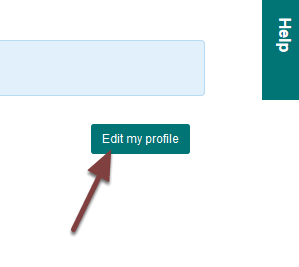
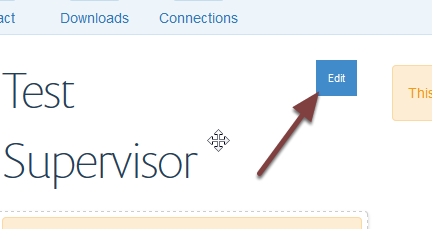
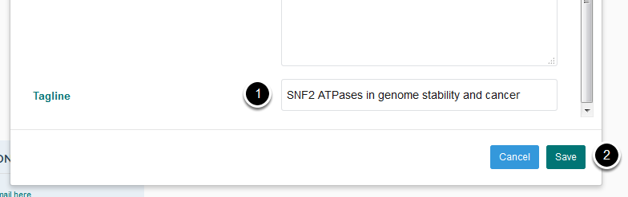
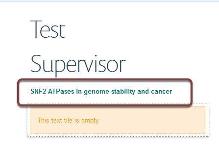
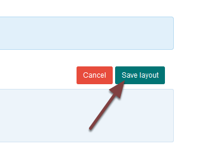

Add Research Interests to a Profile (MSD Graduate School)
=========================================================

Research interests can be added to a profile. Research interests display on the profile, the list of all supervisors, on subject area pages and Doctoral Training Centre course pages. 

This shows you how to add research interests to a local profile created on the MSD Graduate School site. Research interests for remote profiles need to be added by the supervisor to their profile on their department site. 

Edit my profile
---------------

Go to the profile you would like to edit. Click **Edit my profile** on the right of the page. 

Edit personal information
-------------------------

Move you cursor over the Supervisor's name to reveal the **Edit** button. Click **Edit**. 

Add research interests
----------------------

Scroll to the bottom of ther Personal Information tile:

#. Enter the research interests into the **Tagline** field
#. Click **Save**

You can now see the research interest under the supervisor's name. 

Save layout
-----------

Click **Save layout**