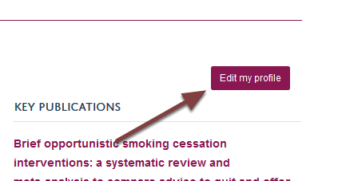
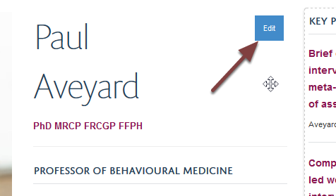
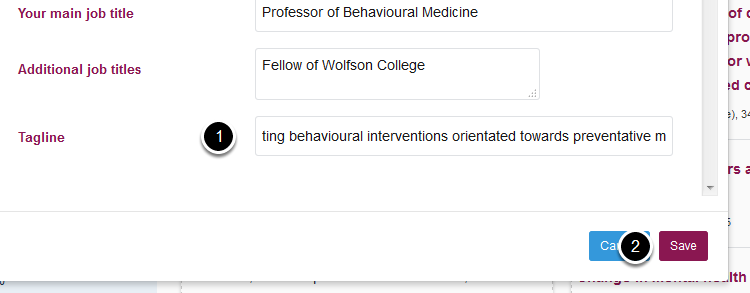
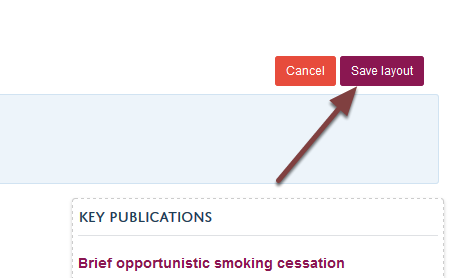
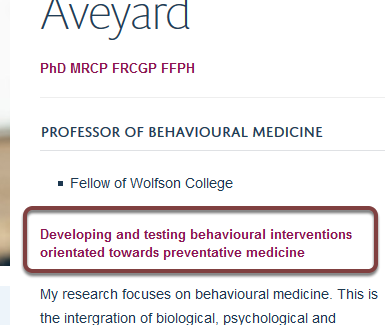
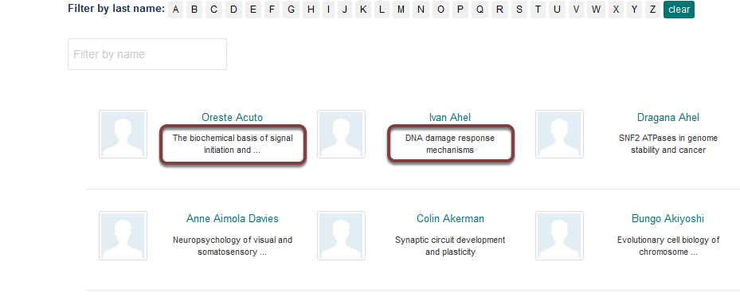

Add a Tagline to your Profile
=============================

A tagline gives you the opportunity to have a short one line summary of your research interests on your profile. 

If you are a supervisor your tagline will also appear on lists of supervisors on the MSD Graduate School website. Taglines provide prospective students with an easy way to scan the options available. 

This shows you how to add a tagline to your profile. 

Edit profile
------------

Go to your profile and click the **Edit my Profile** button.

Edit personal details tile
--------------------------

Hover over the section of the profile with your name to reveal an **Edit** button. Click the **Edit** button to bring up the editing interface. 

Add tagline
-----------

Scroll to the bottom of the editing interface:

#. Enter a short description of your research interests in the **Tagline** box.
#. Click **Save.**

Save layout
-----------

Click the **Save layout** button at the top right of your profile. 

Your tagline
------------

You will now see the tagline on your profile under your job titles (above) and on lists of supervisors on the MSD Graduate school website (below). 

