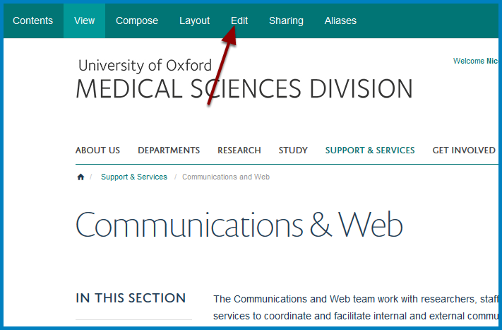
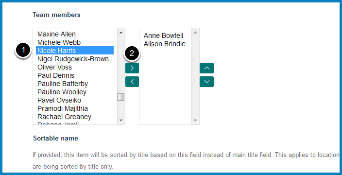
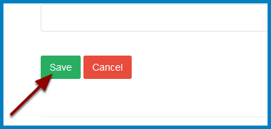

Add a Team Member
=================

You can add anyone who has a profile on the Medical Sciences Division website to your team. 

If you need a profile for a new member of staff please email: webmaster@medsci.ox.ac.uk

Edit Team Page
--------------

Go to your Team page and click **Edit** at the top of the page.

Team members
------------

Scroll down the page to the **Team members** section.

The column on the left lists all people who are not currently listed as members of your team and the column on the right people who are. 

To add a team member:

#. Select the person you would like to add from the list in the left column.
#. Click the top arrow.

Change the order of team members
--------------------------------

To change the order of the team member make sure that the name is selected and click the up and down arrows to move the person to the required position.

Save your changes
-----------------

Scroll to the bottom of the page and click **Save**.

Further Information
-------------------

* :doc:`Remove a Team Member <remove-a-team-member>`
* :doc:`Change the Order of Team Members <change-the-order-of-team-members>`

If you are listing Profiles in a Column please see: 

* :doc:`Remove Profiles from a Column Listing Profiles <remove-profiles-from-a-column-listing-profiles>`
* :doc:`Add a Profile to a Column Listing Profiles <add-a-profile-to-a-column-listing-profiles>`
* :doc:`Change the Order of Profiles in a Column Listing Profiles <change-the-order-of-profiles-in-a-profiles-listing-column>`

