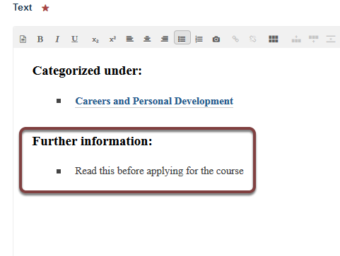

Add an Attachment to a Course Page
==================================

This shows you how to add an attachment (pdf or word document) to a Skill Training course. This process has two stages: you need to upload the document and then add a portlet to the right side of the page to link to the attachment. 

Add new
-------

Go to the course page.

Click **Add new...** and select **Attachment**. 

Upload document
---------------

#. Give your document a title.
#. Click **Browse** and upload your file.
#. Click **Save**.

Return to the course page
-------------------------

.. image:: images/add-an-attachment-to-a-course-page.rst/return-to-the-course-page.png
   :alt: 
   :height: 192px
   :width: 642px
   :align: center

Click the course title in the breadcrumb trail to go back to your course page. 

Portlet
-------

If your page hasn't already got a portlet on the right of the page you will need to add one. See the :doc:`Add a Portlet to the Right Side of a Course Page <add-a-portlet-to-the-right-side-of-a-course-page>` guide for details on how to do this. 

Link attachment from the portlet
--------------------------------

.. image:: images/add-an-attachment-to-a-course-page.rst/link-attachment-from-the-portlet.png
   :alt: 
   :height: 279px
   :width: 351px
   :align: center

Click your name at the top right of the page and select **Manage portlets**. 

Click the portlet title to open the editing interface:

Type a heading and link text for you document. 

#. Highlight the text you would link to create the link on.
#. Click the link icon. 

#. Select the document you just uploaded (this should be visible when you open the link box; if it isn't use the breadcrumb trail or search box to find your document).
#. Click **OK**. 

Save portlet
------------

Scroll to the bottom of the page and click **Save**.

Click **Return** to go back to your course page.

Your document has now been added to your course page. 