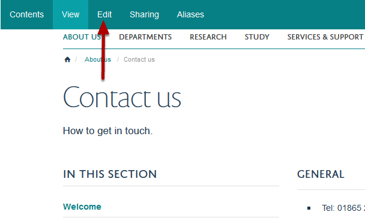
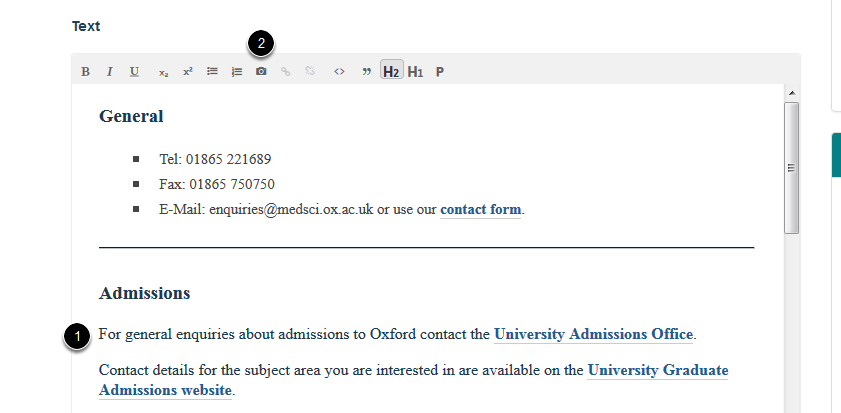
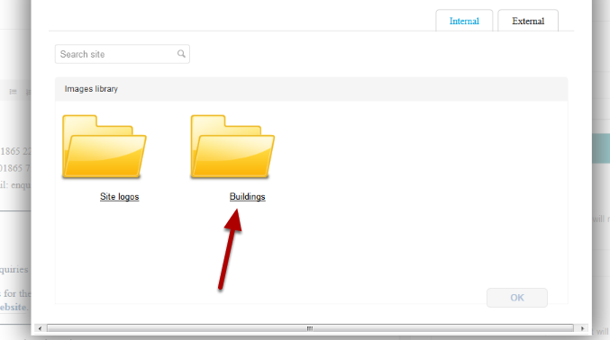
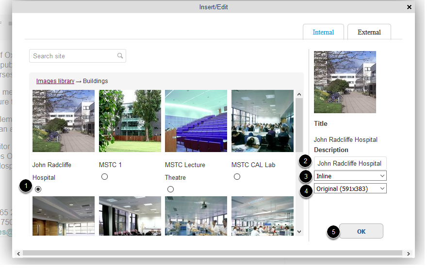
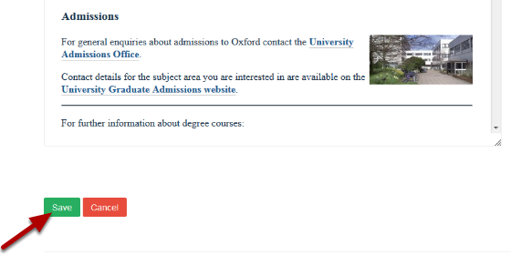

Add an Image into the Main Text of your Page
============================================

This shows you how to add an image into the main text content of your page. You need to upload the image to the Image Library first. See the :doc:`**Upload an Image to the Image Library** <upload-an-image-to-the-image-library.html>` guide if you need instructions on how to do this. 

Edit page
---------

Go to the page where you would like to add the image.

Click **Edit**. 

Scroll down the page to the text editor.

#. Place your cursor where you would like to insert the image.
#. Click the camera icon.

Image Library
-------------

You will see a list of the folders in your Image Library.  Select the relevant folder. 

Select image
------------

#. Select the image you would like to add.
#. Enter a description.
#. Select the position of the image. Ideally have all images on the right side of the page to have a consistent look and feel to pages. 
#. Select the image size. If selecting one of the . will resize on the width of the page not
#. Click OK.

Save the page
-------------

Click the **Save** button.