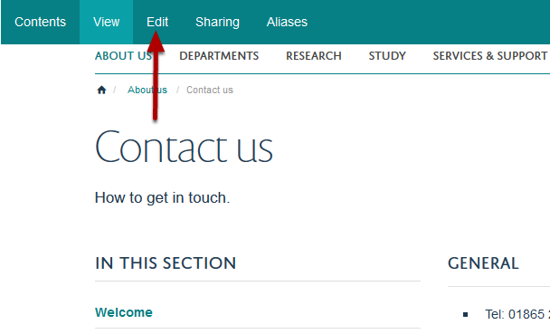
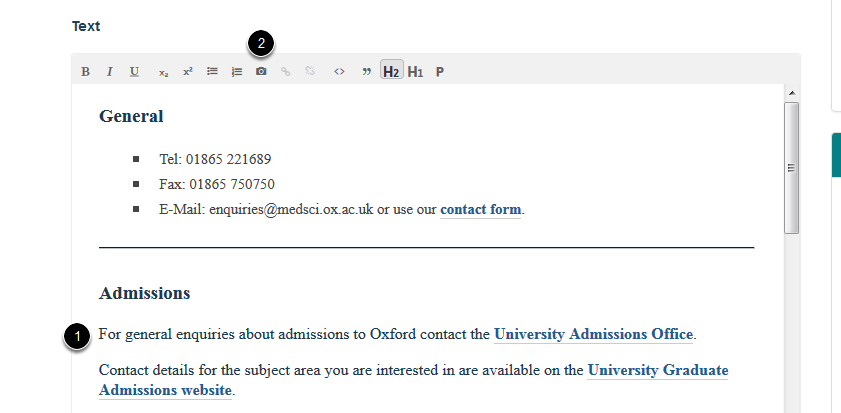
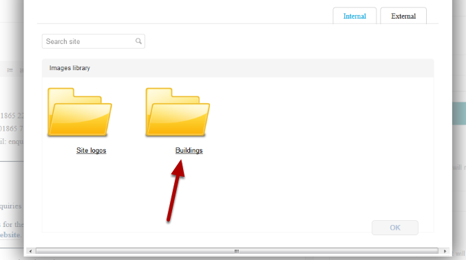
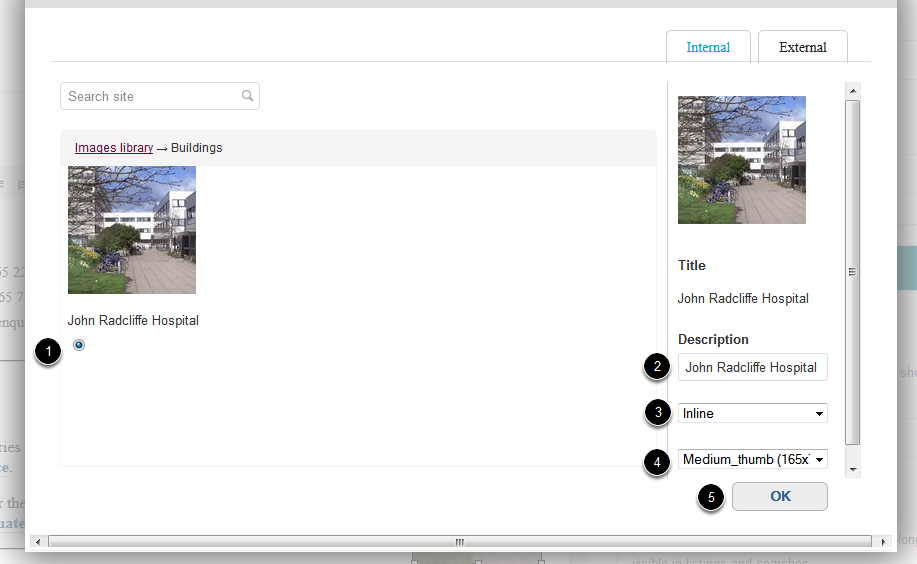
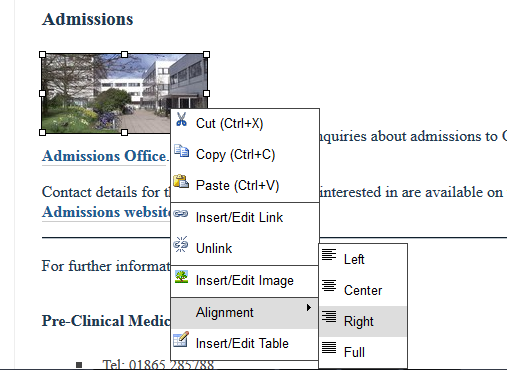

Add an Image into the Main Text of your Page
============================================

This shows you how to add an image into the main text content of your page. You need to upload the image to the Image Library first. See the **Upload an Image to the Image Library** guide if you need instructions on how to do this. 

Edit page
---------

Go to the page where you would like to add the image.

Click on Edit. 

Scroll down the page to the text editor.

1. Place your cursor where you would like to insert the image.

2. Click on the camera icon.

Image Library
-------------

You will see a list of the folders in your Image Library.  Select the relevant folder. 

Select image
------------

1. Select the image you would like to add.

2. Enter a description.

3. Select the spacing around the image. 

4. Select the image size.

5. Click on OK.

Position image on page
----------------------

To position the image right click on the image and go to **Alignment**. Select where you would like the image to be positioned.

Save the page
-------------

.. image:: images/add-an-image-into-the-main-text/save-the-page.png
   :alt: 
   :height: 280px
   :width: 560px
   :align: center

Click on the **Save** button.