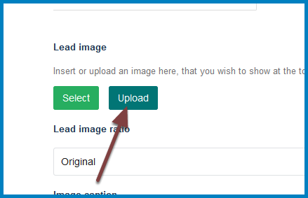
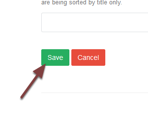

Add an Image to a Column Page
=============================

.. note:: these user guides are being phased out and replaced with the guides on `Haiku Knowledge Base <https://fry-it.atlassian.net/wiki/display/HKB/Haiku+Knowledge+Base>`_

You can add a banner style image across the top of a column webpage. This image needs to be 702 pixels wide x 336 pixels high. 

Edit page
---------

Go to the page you would like to add an image to and click **Edit** on the toolbar at the top of the screen. 

Upload image
------------

#. Click the **Browse...** button to upload your image. The image needs to be 702 pixels wide by 336 pixels high. If you have any problems resizing your image email webmaster@medsci.ox.ac.uk
#. If appropriate enter a caption for the image. (Optional)
#. Enter copyright information. 

Save
----

Scroll to the bottom of the page. Click **Save**. 

Your page
---------

The image has been added to your page, with the caption below the image and the copyright information in the bottom right corner. 