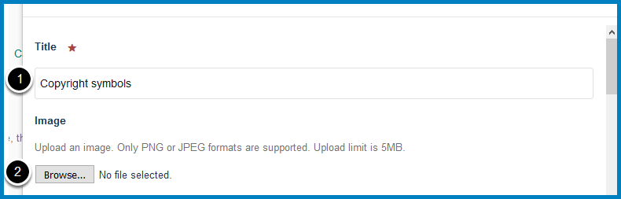
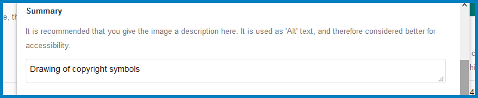
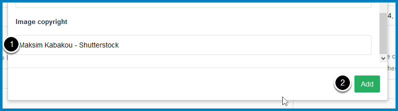
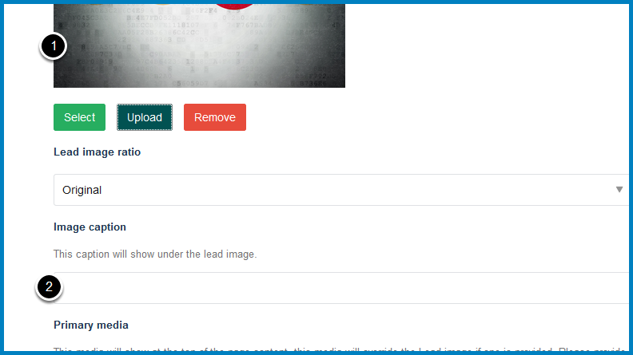
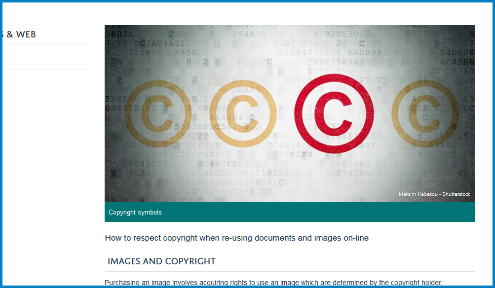

Add an Image to a Column Page
=============================

You can add a banner style image across the top of a column webpage. This image needs to be 702 pixels wide x 336 pixels high. 

Edit page
---------

Go to the page you would like to add an image to and click **Edit** on the toolbar at the top of the screen. 

Media section
-------------

Select the **Media** link.

Upload image
------------

.. image:: images/add-an-image-to-a-column-page/upload-image.png
   :alt: 
   :height: 273px
   :width: 429px
   :align: center

Click **Upload **to open the image upload box. 

#. Enter a title for the image
#. Click **Browse...** and select the image from your computer. The image needs to be 702 pixels wide by 336 pixels high. If you have any problems resizing your image email webmaster@medsci.ox.ac.uk.

Scroll down the image upload box. Enter some descriptive text in the summary box. This is the text that people who use screen readers (and search engines) will use to know what your image is about. 

#. Enter copyright information for the image. 
#. Click the **Add** button. 

#. You will see that you image has been uploaded to the page.
#. If appropriate enter a caption for the image (optional). 

Save
----

Scroll to the bottom of the page. Click **Save**. 

Your page
---------

The image has been added to your page, with the caption below the image and the copyright information in the bottom right corner. 