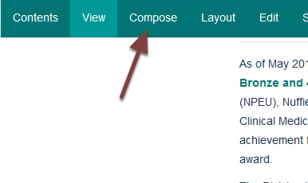
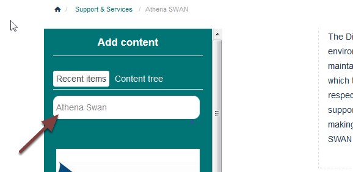
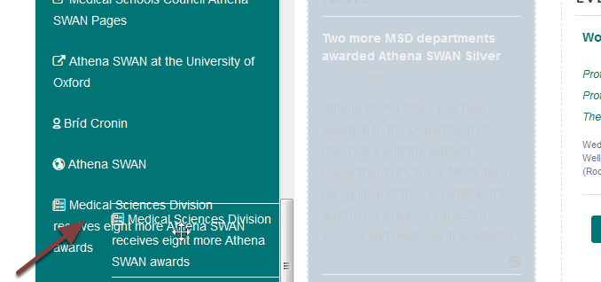

Add an Item to a List of Items Column
=====================================

You can pull items from other parts of the website - for example news items - onto a list of items column. This shows you how to do this.

Compose
-------

Go to your team page and click **Compose** on the toolbar at the top of the page. 

Search for item
---------------

Search for the item you would like to add in the seach box on the left of the screen.

Drag item to column
-------------------

Hold your mouse button down on the item you would like to add to your column and drag it to the list of items column. You will see that the list of item column changes colour as you drag the item onto it. 

Change order of items
---------------------

New items are added to the bottom of the column. To change the order go to the editing interface by moving your cursor over the column to reveal and click the **Edit** button in the top left corner. 

Move item
---------

Hold your mouse button down on the title of the item you would like to move and drag it to the correct position. 

Save
----

Scroll to the bottom of the editing interface and click **Save**. 

Further information
-------------------

* :doc:`Remove an Item from a List of Items Column <remove-an-item-from-a-list-of-items-column>`