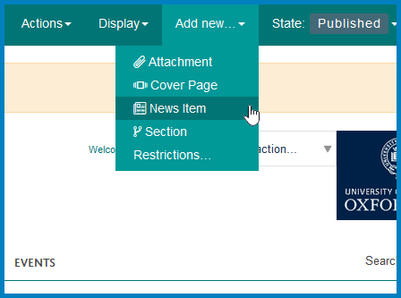
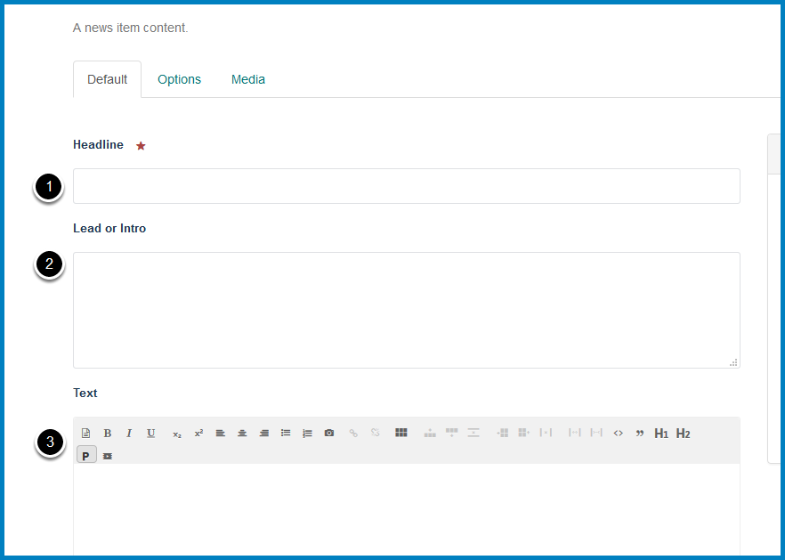
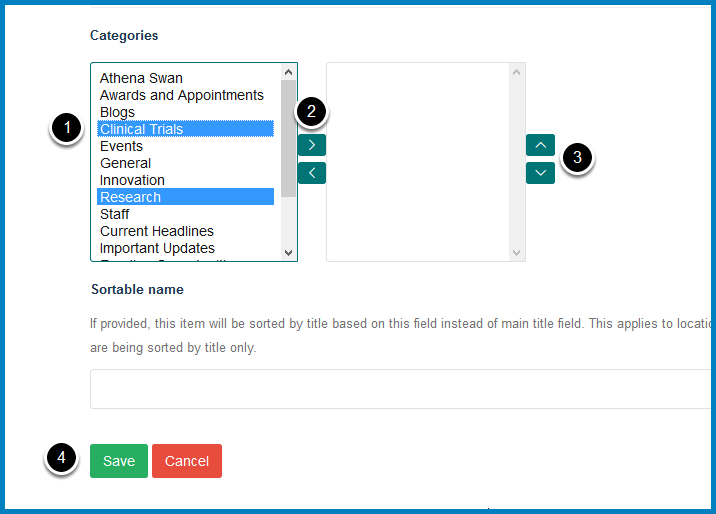
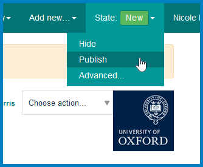
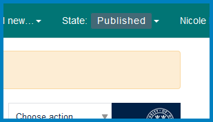

Add a News Item to the MSD website
==================================

This shows you how to add a news item to the news section - `https://www.medsci.ox.ac.uk/news <https://www.medsci.ox.ac.uk/news>`_

We add all news that relates to the Medical Sciences Division from the main University site - `http://www.ox.ac.uk/news-and-events <http://www.ox.ac.uk/news-and-events.>`_. To check whether a news item is from a department or unit in the Medical Sciences department look at the list on our website - `https://www.medsci.ox.ac.uk/departments <https://www.medsci.ox.ac.uk/departments.>`_. Other news items will be emailed to you. 

Add new
-------

Go to `https://www.medsci.ox.ac.uk/news <https://www.medsci.ox.ac.uk/news>`_

Click **Add new...** from the toolbar at the top of the screen and select **News Item**.

Add main content
----------------

#. Enter the title.
#. Enter the first sentence or two of the news item. This will appear on the page listing all the news `(https://www.medsci.ox.ac.uk/news) <(https://www.medsci.ox.ac.uk/news)>`_ as well as on the news item. It isn't possible to format the text in this field. If there are links in the first couple of sentences which can't be moved elsewhere in the text or if the first couple of sentences don't make sense without the following text leave this field blank.
#. Enter the text. If you are copying a news item from the main University news site or a department website copy the first paragraph and add a Read more link to the news item in the original location. If you are linking to another website, apart from the main Univeristy news site, add the department in brackets eg Read more (Department of Physiology, Anatomy and Genetics website). 

**Note:** news items from The Conversation should be added in the format in this item - `https://www.medsci.ox.ac.uk/news/is-schizophrenia-written-in-our-genes <https://www.medsci.ox.ac.uk/news/is-schizophrenia-written-in-our-genes>`_ with the following text at the end of the first paragraph of the item:

Read the full article on The Conversation website, written by person's name, department.

Oxford is a subscribing member of The Conversation. Find out how you can write for The Conversation.

Scroll down the page to the Add categories section.

Add categories
--------------

We have two news sections on our site using different categories. The only categories which should be used in this section are: Athena Swan, Awards and Appointments, Blogs, Clinical Trials, Events, General, Innovation, Research and Staff. **Note:**  **Awards and Appointments** category - if news items have only been assigned this category they won't appear on the news feed on the homepage (`https://www.medsci.ox.ac.uk/) <https://www.medsci.ox.ac.uk/>`_.  

#. The items in the column on the left are categories which haven't been applied to the news item. To assign categories to a news item these need to be moved to the column on the right. Click the names of the categories you would like to assign to the news item. 
#. Click the top arrow to move the items to the column on the right assigning them to the news item. 
#. You can change the order of the categories by selecting the item and using the up and down arrows. 
#. Click **Save**.

Add an image
------------

Where possible add an image to the news item.

See the :doc:`Add an Image to an MSD News Item <add-image-news-item>` guide for details on how to do this. 

Publish the News Item
---------------------

Click **State** on the toolbar at the top of the page and select **Publish**.

The State of the page has now changed to **Published**. 

If the item added was copied across from the main University new site email Alison to let her know that you've added it. 