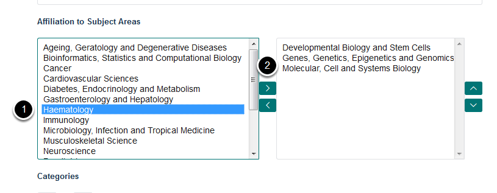

Assign Subject Areas to Courses
===============================

Subject Areas are assigned to courses on the course page. This shows you how to do this. 

Course page
-----------

Go to the course page you would like to assign subject areas to. 

Click **Edit** on the toolbar at the top of the screen.

Subject area affilitations
--------------------------

Scroll down the page to the **Affiliation to Subject Areas** section. The column on the left shows you the available subject areas and the column on the right shows you the subject areas which have been assigned to the course. 

To add subject areas:

#. Highlight the subject area you would like to assign to the course.
#. Click the top arrow to move it to the column on the right. 