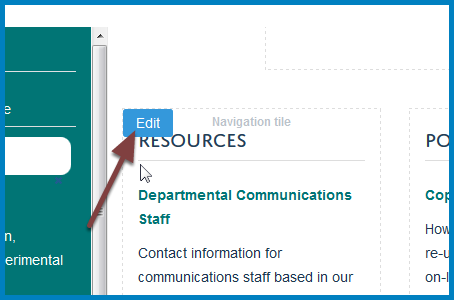

Change a Column Title
=====================

You can change the title on your column. You will also need to change the name of the column so that this change is reflected in the navigation on the left of your team page. 

Compose
-------

Go to your team page. Click **Compose** on the toolbar at the top of the page.

Edit column title
-----------------

Move your cursor to the column you would like to edit to reveal an **Edit** button. Click the **Edit** button to go to the editing interface. 

Enter the new column title in the **Title** field.

Save
----

Scroll to the bottom of the editing interface and click the **Save** button.

The column title will have changed. 

Change column name in navigation
--------------------------------

However, the column title won't have changed in the navigation on the left of the team page. You will need to rename the column to change this. 

Content
-------

Click **Contents** on the toolbar at the top of the page. 

#. Select the checkbox next to the column you would like to rename.
#. Click the **Rename** button.

#. If you would like the web address to reflect the name of the column enter a new address in the **New Short Name** field (this forms the part of the address after your team name). Use lower case and don't include any spaces.
#. Enter the new column title in the **New Title** field.
#. Click the **Rename All** button.

Team page
---------

Click **View** to return to your team page.

The navigation now uses the new column name.  