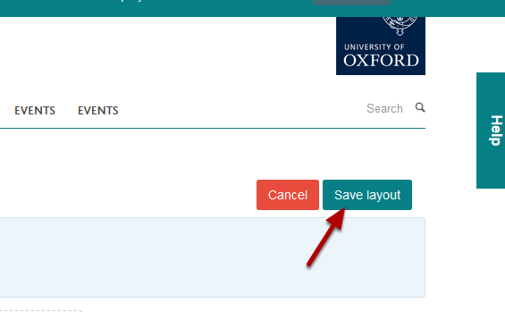

Change a Profile Image
======================

.. note:: These user guides are being phased out and replaced with the guides on `Haiku Knowledge Base <https://fry-it.atlassian.net/wiki/display/HKB/Haiku+Knowledge+Base>`_

This shows you how to replace an image on a profile. If you want to delete an image without replacing it please login to the helpdesk and ask for it to be removed. 

Go to profile
-------------

Go to the profile where you would like to change the image. 

Click on **Edit my profile**.

Change the image
----------------

Move your cursor over the profile image to bring up the **Edit** button. Click on the Edit button to bring up the editing interface:

1. Click on **Browse ... **and upload the new image.

2. Click on Save.

Save layout
-----------

Click on the **Save layout** button. 