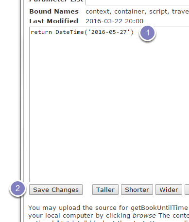

Change the Book By Date on Skills Training Courses
==================================================

This shows you how to change the Book By Date on the Skills Training Courses.

Login
-----

Go to `https://skillstraining.medsci.ox.ac.uk/skills/portal_skins/custom-skills/getBookUntilTime/ZPythonScriptHTML_editForm <https://skillstraining.medsci.ox.ac.uk/skills/portal_skins/custom-skills/getBookUntilTime/ZPythonScriptHTML_editForm>`_ and login with the username and password for the old website (not your SSO username and password). 

Change date
-----------

#. Change the date - ensure it is in the following format:  yyyy-mm-dd and that it has inverted commas around it and brackets   -  return DateTime('2016-05-27')
#. Click **Save Change**.