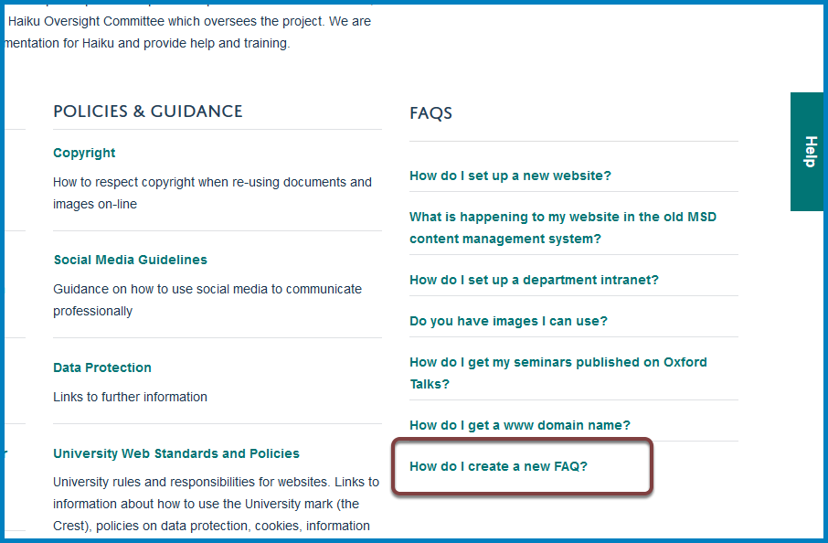
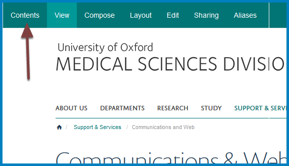
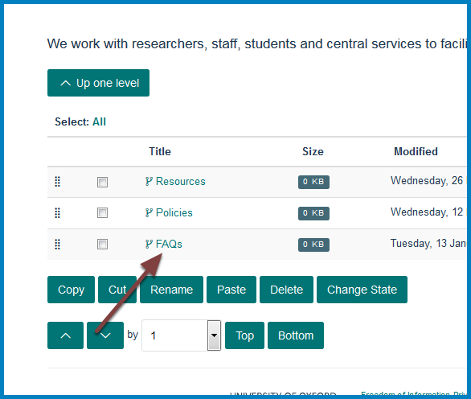
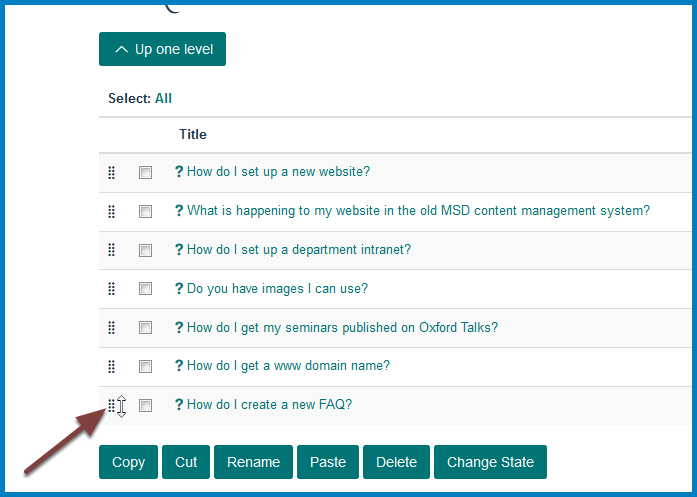
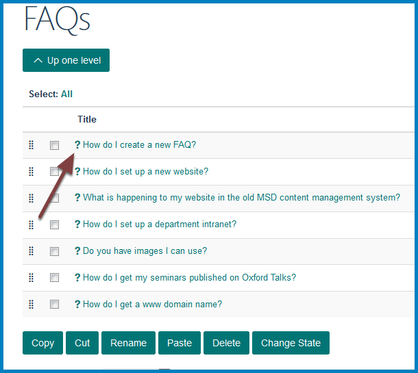
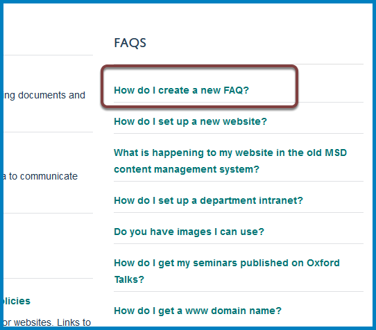

Change the Display Order of FAQs
================================

By default FAQs display in the order they were added to the website. This shows you how to change the order. In this example we are going to move **How do I create a new FAQ?** to the top of the list:

Contents
--------

Click **Contents** on toolbar at the top of your team page.

FAQs
----

Select your FAQs section.

Change the order of FAQs
------------------------

This list shows the FAQs in the order they appear on your team page. To change the order hold down your mouse button on the set of dots to the left of the FAQ and drag the FAQ to the required position - in this case the top of the list: 

Team page
---------

Returning to the team page you can see the FAQ is at the top of the list.  

Further Information
-------------------

* :doc:`Create a FAQs section <create-a-faqs-section>`
* :doc:`Edit a FAQ <edit-a-faq>`
* :doc:`Add a FAQ <add-a-faq>`
* :doc:`Set the number of FAQs on display on your team page <set-the-number-of-faqs-on-display-on-your-team-page>`