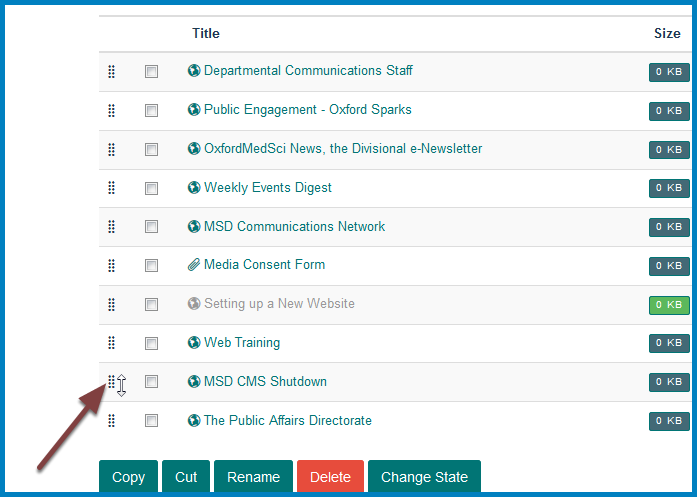

Change the Display Order of Webpages, Links or Documents in a Column
====================================================================

By default webpages, links and documents display in the order they were added to the column. This shows you how to change the order. 

Contents
--------

Click **Contents** on toolbar at the top of your team page.

Columns
-------

Select the column where you would like to change the order of the contents. 

Change the order
----------------

This list shows the column contents in the order they appear on your team page. To change the order hold down your mouse button on the set of dots to the left of the item you would like to move and drag it to the correct position. 