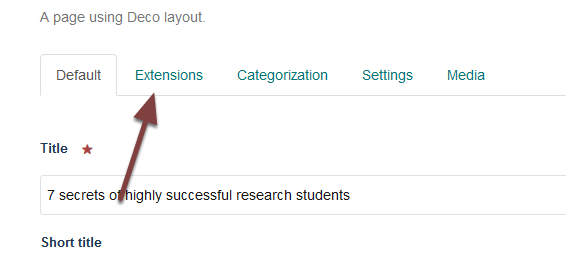
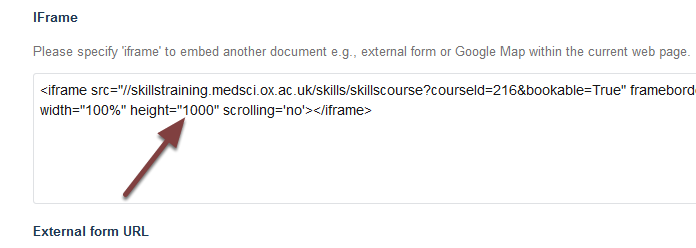
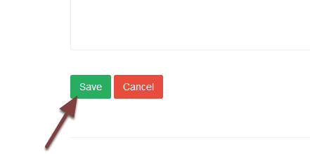

Change the Length of the Course iFrame
======================================

This shows you how to change the amount of space available on the page for the course information that feeds from the database. 

Edit page
---------

Go to the course page. Click **Edit** on the toolbar at the top of the screen. 

Click the **Extensions** tab.

Change height
-------------

Change the height value. Start increasing or decreasing the value by 100 or 200. 

Save
----

Scroll to the bottom of the page and click **Save**. 