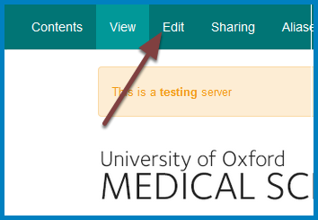
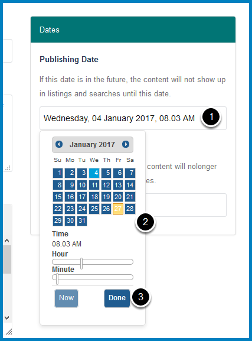
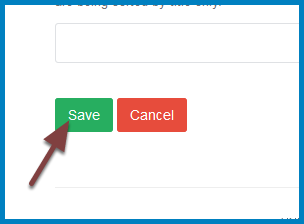

Change the Order / Publication Date of a News Item
==================================================

News items are ordered by publication date. You can change the publication date to change the order of a news item. This show you how to do this. 

Edit page
---------

Go to the news item and click **Edit**. 

Publication date
----------------

#. Click in the **Publishing Date** field to bring up the date picker. 
#. Select the new date or click the **Now** button at the bottom of the date picker.
#. Click the **Done** button.

Save
----

Scroll to the bottom of the page and click the **Save** button. 