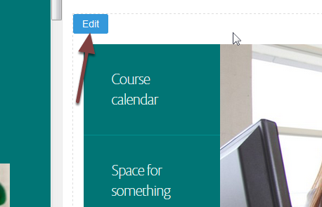
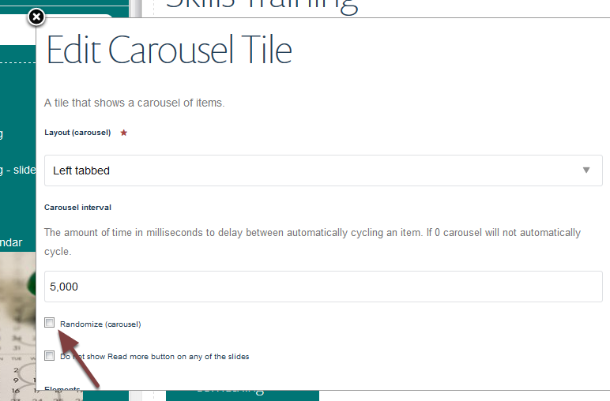

Change the Order of Slides on the Slideshow
===========================================

You can control the order of the slides on your slideshow.

Edit your page
--------------

Go to the page with the slideshow and click **Compose** on the toolbar at the top of the screen. 

Hover over the slideshow to bring up an **Edit** button. Click this button. 

Change the order of the slides
------------------------------

This opens a window which controls the slideshow. 

If you want the slides in a particular order ensure that the **Randomize** box **isn't** selected. 

Scroll down the editing window to see your slides in the order that they are displayed on the slideshow. 

To change the order of the slides:

#. Move your cursor over the title of the slide you would like to move. You will see a fourway arrow. Click the title and drag the slide to the position in the list of slides.
#. Click **Save.**